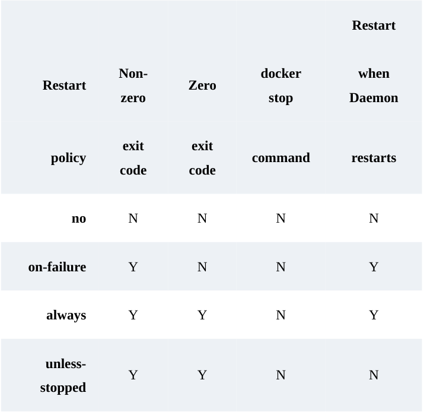

how containers start apps:
1. an entrypoint instructions
2. a cmd instructions
3. a cli argument

difference between entrypoint and cmd?
seems entrypoint cannot be overidden on the cli, the cli will only append, while cmd are overriden by cli arguments

the docker run command:
docker run <arguments> <image> <command>

command is optional, and will override the cmd instructions

connecting to a container:
docker exec

like
docker exec -it "name" sh

-it flag makes an interactive exec session, and sh start and new sh process for the shell.

we can also run commands without entrying the container
remove the -it flag,
docker exec "name" ls

docker inspect command shows all details about images and containers

Self healing:
policies:
no (default)
on-failure
always
unless-stopped

need to summerize when each happens, attaching a photo:

we can set the policy at the docker run command
docker run --name "name" --restart "policy" "image" "cli args"