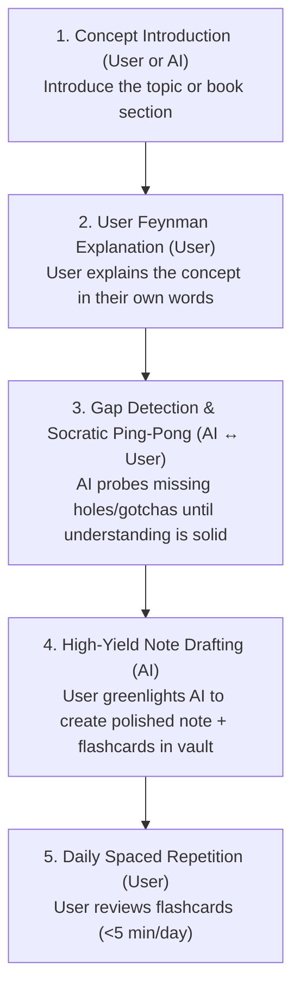

# 🧠 Dor-Brain: AI Operating Instructions & Learning Protocol

This document is the **Standard Operating Procedure (SOP)** for any AI assistant and user collaborating within the `dor-brain` vault. Follow these instructions whenever learning new topics, summarizing books/articles, or studying Go, Linux, and systems engineering.

---

## 🎯 The Core Philosophy: "Active Understanding Over Note Collection"

1. **Defeat the Collector's Fallacy:** Having notes in your vault is not the same as having them in your brain. Notes are only written **after** you have proven comprehension.
2. **Beginner-Friendly Clarity:** Explain every concept using clear, everyday analogies (storage boxes, light switches, price tags) and define all technical terms in plain English.
3. **The Ping-Pong Feynman Rule:** The user explains the concept in their own words. The AI probes for gaps until the mental model is bulletproof, and only then creates the note.
4. **Atomic & Modular Graph:** Large topics branch from a central hub into modular sub-notes connected through `[[WikiLinks]]`.

---

## 🔄 The 4-Step Collaborative Workflow (The "Ping-Pong Protocol")

### Step 1: Concept Introduction
* The user reads a section of a book (e.g. *Learning Go*) or picks a topic (e.g. `systemd` services).
* Either the user or the AI frames the core question/mechanism to focus on.

### Step 2: User Feynman Explanation (User Explains First)
* The user explains the concept in their own words, gut feel, or practical intuition.
* The user does not need to worry about formal jargon—plain English is preferred.

### Step 3: Gap Detection & Socratic Ping-Pong (AI $\leftrightarrow$ User)
* **AI Analysis:** The AI evaluates the user's explanation against the source material (e.g., Jon Bodner's book, Linux manuals).
* **Finding the Blindspots:** If the user missed critical gotchas, compiler rules, or edge cases, the AI does **not** lecture. Instead, the AI asks targeted, scenario-based questions:
  * *"What happens if we do X instead of Y?"*
  * *"Why would this specific line throw an error?"*
* **The Ping-Pong:** User and AI discuss back-and-forth until the user clearly grasps the complete mental model.

### Step 4: High-Yield Note Creation (AI on Greenlight)
* Once the concept is understood, the user asks the AI to create/update the note.
* The AI formats the note into `6 - Main notes/` using the template `5 - Templates/Programming Note.md`:
  1. `## 🧠 The Core Concept` (Includes the user's verified mental model).
  2. `## 💻 Syntax & Minimal Example` (Clean, compiling 10-15 line snippet).
  3. `## ⚠️ Common Pitfalls (The "Gotchas")` (The edge-cases uncovered in the ping-pong).
  4. `## 🔗 Connections (Mental Mapping)` (Bidirectional `[[WikiLinks]]`).
  5. `## ⚡ Active Recall Flashcards` (3–5 cards in `Prompt::Answer` format).

### Step 5: Daily Spaced Repetition (User)
* The user reviews the Spaced Repetition flashcards daily (<5 minutes) in Obsidian.

### Step 6: Drills (User + AI, 2 to 3 times a week)
* Hands-on practice for composition skills (write a script, a unit file, a one-liner) from a blank terminal. The AI generates a fresh task, the user solves it, the AI runs and grades it, and misses become flashcard candidates. Protocol: `7 - Drills/Drill Protocol.md`. Trigger: `/drill` in Claude Code, `drill` in Gemini CLI.

---

## 📂 Vault Structure & Folder Conventions

| Directory | Purpose | Rules |
| :--- | :--- | :--- |
| `1 - Rough Notes/` | Scratchpads, quick thoughts, temporary working logs | Transient, unpolished notes |
| `2 - Source Material/` | Raw books, PDF transcripts, cheat sheets | Reference dumps only |
| `3 - Tags/` | Tag indexes and hierarchies | Managed via YAML frontmatter |
| `4 - Indexes/` | Master maps of content (MOCs), operating guides | High-level overviews and SOPs |
| `5 - Templates/` | Standardized Obsidian markdown templates | Used for new notes (`Programming Note.md`, etc.) |
| `6 - Main notes/` | Permanent, atomic, interconnected knowledge notes | Organized by domain subfolders (e.g. `01 - Processes & Linux Core`, `02 - Security & Permissions`, `03 - Containers & Platform Primitives`, `04 - Systemd & Node Supervision`, `05 - Networking & Web`, `06 - Bash & Shell Scripting`, `07 - Go & Software Engineering`, `08 - Kubernetes & Cloud`). Bash is split one note per drill skill under a hub note `Bash`; see `7 - Drills/Drills - Bash.md` for the mapping |
| `7 - Drills/` | Hands-on practice: protocol, per-language skill registries, attempt log, solutions | See `7 - Drills/Drill Protocol.md`. Registries are tagged `#review` so the SR plugin schedules them |

---

## 🧭 The SRE / Platform Engineer / Developer Focus Filter

Every concept studied in this vault is viewed through three core lenses:
1. **🚨 SRE & Reliability:** How does it fail in production? What are the symptoms (OOM, high load in state D, zombie leaks, file descriptor exhaustion)? How do we triage it at 3 AM using `/proc`, `strace`, `lsof`, `ss`, `top`?
2. **☸️ Platform Engineering & Containers:** How does this kernel primitive power Docker, Podman, and Kubernetes? What are the namespace, cgroup, capability, or seccomp boundaries?
3. **💻 Software Development (Go / Backend):** How does application code interact with this via syscalls? What concurrency, memory leak, socket cleanup, or graceful shutdown gotchas exist?

### The 3 Knowledge Depth Tiers
- **🔥 Tier 1: Deep & Practical Mastery (Core Drivers):** Processes, signals, memory, `/proc`, namespaces, capabilities, cgroups, I/O, networking, systemd, Go internals. Deep ping-pong, full triage workflows, 3-5 high-yield cards.
- **🛡️ Tier 2: Mental Model & Triage Hooks (Architecture + Debug Steps):** SELinux/MAC (AVC denials, `restorecon`), SUID (container privilege escalation), sudoers (`visudo`, locked service accounts). Solid mental model, 2-3 cards.
- **🧠 Tier 3: 30,000-Foot General Knowledge:** Legacy sysadmin tools (PAM, classic Apache/httpd, SysV init). Focus on *what problem it solved* and *where it lives*. 1-2 concept cards max; skip arcane config syntax trivia.

---

## 🏷️ Flashcard Rules (Strict Standard)

All flashcards at the bottom of notes **must** adhere to `4 - Indexes/Flashcard System & Memory Guide.md`:

1. **Format:** `Prompt::Answer` on a single line for structure cards. Production cards (code the user must type) use the multiline form: prompt line, a line containing only `?`, then the code, terminated by a blank line.
2. **Deck Tag:** Must include a valid subdeck path in YAML (e.g., `flashcards/linux/systemd`, `flashcards/containers/runc`, `flashcards/k8s/networking`).
3. **Card Limit:** **2 to 5 cards** for concept notes; syntax-heavy notes (Bash, Go, unit files) may go to **8**, of which at most 3 are multiline production cards.
4. **Two Lanes, One Filter:** Syntax belongs in the deck only if an interviewer would expect it produced from memory at a blank terminal. `if [ ]; then ... fi` passes; `${var,}` does not. Everything else that is syntax-shaped goes into a reference section of the note or into `7 - Drills/`.
   * **Structure card:** the model behind the syntax ("what three things does a static route need, and why each?"). Single line.
   * **Production card:** a task, answered by code you type. Multiline. Review rule: type it in a terminal before flipping; if you could not produce it, press Again no matter how familiar the back looks.
5. **Card Maintenance (during review, not later):** a card that feels useless gets deleted (trivia) or reformulated into a scenario or "why" card (right topic, wrong angle) on the spot. A card failed three times gets reformulated or deleted, never re-buried. Misses discovered in `7 - Drills/` are the best source of new cards.
6. **Golden Card Types (High-Yield Practical Retrieval):**
   * **Scenario $\rightarrow$ Action/Command:** `How can an SRE truncate an active deleted log file without restarting the app?::Find its FD in /proc/<PID>/fd/ and truncate directly (> /proc/<PID>/fd/<N>)`
   * **Symptom $\rightarrow$ Root Cause / Danger:** `What does high load average + low CPU + high %wa indicate?::System is bottlenecked on disk/network I/O; processes are stuck in state 'D' (Uninterruptible Sleep)`
   * **Architecture $\rightarrow$ "Why":** `Why do containers map UID 0 to unprivileged host UIDs using User Namespaces?::To prevent container escapes from gaining root privileges on the host kernel`

---

## 🧭 Checklist for AI on Every Session

- [ ] Did I filter the topic through the SRE / Platform / Software Developer lens?
- [ ] Did I let the user explain the concept in their own words first?
- [ ] Did I detect missing holes or gotchas and ask targeted Socratic questions?
- [ ] Did I apply the interview filter to every syntax card (produce from memory at a blank terminal, or it is not a card)?
- [ ] Did I write "which command does X" prompts as a real situation instead ("a service hangs on stop, force it down")?
- [ ] Did I wait for user alignment/greenlight before generating the final note?
- [ ] Did I structure/split the information into modular, atomic notes with `[[WikiLinks]]`?
- [ ] Did I include 2–5 active recall flashcards focused on architecture 'Why', failure symptoms, and triage actions?
