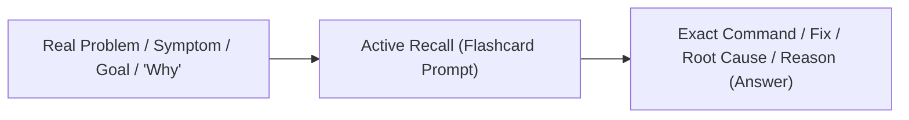

# 🧠 Flashcard System & Long-Term Retention Guide

This document defines the standard operating procedure for creating, structuring, and reviewing flashcards in this vault to guarantee **high-speed daily reviews (<5 mins)** and **deep architectural retention**.

---

## 🎯 The Core Philosophy: "Retrieval over Recognition"

In software engineering and systems administration, real problems present as a **symptom, architectural decision, or goal**, requiring you to produce the **tool, command, root cause, or design rationale**.

Your flashcards must train the exact neural pathways you use on the job:



---

## 🔬 Cognitive Science Principles for Bulletproof Flashcards

### 1. The Minimum Information Principle (Dr. Piotr Wozniak)
* **The Rule:** Each card must test **one atomic link in memory**.
* **Avoid "Card Bloat":** Never append summary paragraphs or multi-line briefs to the answer. If a card takes >10 seconds to read and evaluate, it changes from **effortless recall** to **reading comprehension**, causing review fatigue.
* **Unambiguous Grading:** You should know within 3 seconds whether you got the card 100% right or wrong.

### 2. Multi-Perspective Atomic Pairing (Andy Matuschak)
Instead of putting a long architectural brief on the back of a syntax card, **test the mental model directly with dedicated "Why" and "Danger" prompts**:

| ❌ Bloated Card (Slow & Ambiguous) | ✅ Atomic Multi-Perspective Pairing (Fast & Deep) |
| :--- | :--- |
| **Q:** Where do custom admin unit files belong in systemd?<br/><br/>**A:** `/etc/systemd/system/`<br/>*(Summary: Understanding these two paths prevents config loss... 1. `/usr/lib` package defaults 2. `/etc` overrides)* | **Card 1 (Muscle Memory / Location):**<br/>`Where do custom admin unit files and overrides belong in systemd?::/etc/systemd/system/`<br/><br/>**Card 2 (Architectural "Why" / Danger):**<br/>`Why must custom systemd unit edits go into /etc/ instead of /usr/lib/?::Package updates overwrite /usr/lib/; /etc/ persists and overrides them`<br/><br/>**Card 3 (System Precedence):**<br/>`When a unit file exists in both /etc/ and /usr/lib/, which directory takes precedence?::/etc/systemd/system/ (admin overrides package defaults)` |

---

## 📐 The 3 Golden Card Templates

### 1. Scenario ➔ Command / Location (Actionable Recall)
*Use this for CLI tools, flags, and system paths.*
* **Prompt:** What you want to do or the problem you are facing.
* **Answer:** The exact command or path.

```markdown
How to force systemd to reload unit files after editing?::sudo systemctl daemon-reload

journalctl flag to stream/follow logs in real-time::`-f`
```

### 2. Symptom / Failure ➔ Root Cause & Danger (Troubleshooting Recall)
*Use this for debugging, gotchas, and error handling.*
* **Prompt:** Why something fails, what danger occurs, or what happens under specific conditions.
* **Answer:** The root cause and mechanism.

```markdown
Why do journald logs vanish after a server reboot by default?::Stored in volatile RAM at `/run/log/journal`

What danger occurs when using Restart=always with a broken service config?::Causes an infinite rapid crash loop until systemd trips the start rate limit
```

### 3. Architecture / Mechanism ➔ "Why" (Systems Engineering)
*Use this for Linux primitives, container isolation, and Kubernetes orchestration.*
* **Prompt:** Explicit, unambiguous question about architectural purpose or design decisions.
* **Answer:** Core architectural rationale.

```markdown
Why are Linux capabilities safer than setting SUID root on a binary?::They grant only a single, specific privilege rather than monolithic, full root power

What is the primary difference between a Container and a Virtual Machine?::Containers share the host Linux kernel and isolate processes; VMs run a full guest OS on virtualized hardware
```

---

## 🛤️ Two Lanes for Syntax: Structure Cards and Production Cards

Syntax has to be retrievable from a blank terminal (an interviewer watching your screen, a box at 3 AM). A normal flashcard review tests **recognition**: you read the back and think "yes, I knew that". Recognition does not build **production**. So syntax gets two kinds of card and one review rule.

**The filter for keeping syntax in the deck:** would an interviewer expect me to produce this from memory? `for x in "${arr[@]}"` passes. `${var,}` (lowercase the first character) does not. What fails the filter lives in the note body as reference, or in `7 - Drills/`.

### Structure card (single line)
Tests the model behind the syntax, so the syntax can be reconstructed rather than memorized.

```markdown
What three things does a static route need, and why each?::destination network, netmask (where that network ends), gateway (next hop)
What happens to a variable assigned inside a Bash function without local?::It is global and overwrites any same-named variable in the calling script
```

### Production card (multiline)
A task, answered by code. The plugin's multiline separator is a line containing only `?`; the card ends at the first blank line, so no blank lines inside the answer.

```markdown
Write a Bash function check_node that pings its first argument once with a 2 second timeout, then call it in an if/else that prints healthy or unreachable
?
check_node() {
  local ip="$1"
  ping -c 1 -W 2 "$ip" > /dev/null 2>&1
}
if check_node "$1"; then echo "healthy"; else echo "unreachable"; fi
```

**Review rule for production cards:** type the answer in a terminal before flipping. If you could not produce it, press **Again**, no matter how familiar the back looks. Recognition is not the target.

Limits: concept notes stay at 3 to 5 cards. Syntax-heavy notes may go to 8, with at most 3 production cards.

---

## 🧹 Card Maintenance (do it during review, never "later")

Cards are written before you have any real contact with the concept, so some will turn out useless. Handle it on the spot:

| Situation | Action |
| :--- | :--- |
| Card feels like trivia you would look up | Delete it |
| Right topic, wrong angle ("which command" instead of a situation) | Reformulate into Scenario, Symptom, or Why form now |
| Failed three times (leech) | Reformulate or delete. Never just re-bury |
| A drill in `7 - Drills/` exposed a miss | That miss becomes a card. This is the best card source you have |

Make 2 to 3 cards at note time, not 5. Add more once practice shows what you actually forget.

---

## 🚫 The 4 Anti-Patterns to Avoid

| Anti-Pattern | Bad Example | Good Example |
| :--- | :--- | :--- |
| **1. Command to Definition (Reverse Cloze)** | `daemon-reload :: ==Reloads config==` | `How to reload systemd configs? :: sudo systemctl daemon-reload` |
| **2. Prompt Leaking** | `Run journalctl -n 50 to see ==last 50 lines==` | `Which journalctl flag limits output to N lines? :: -n <N>` |
| **3. Summary on Back (Card Bloat)** | Answer containing a 4-line summary paragraph | Split into 2 atomic cards: Card 1 for the Fact, Card 2 for the "Why" |
| **4. Ambiguous Grading** | `Explain systemd unit files` | `In a systemd unit file, which section defines service restart policies? :: [Service]` |

---

## 📊 Mathematics of Flashcard Scalability (Why 500 Cards $\neq$ Heavy Work)

In modern spaced repetition (FSRS), mature cards expand exponentially:
$$\text{Day 1} \longrightarrow \text{Day 4} \longrightarrow \text{Day 14} \longrightarrow \text{Day 45} \longrightarrow \text{Day 120} \longrightarrow \text{1 Year}$$

$$\text{Daily Reviews Due} \approx \frac{\text{Total Mature Cards}}{\text{Average Interval (in days)}}$$

* For **300 mature cards** with an average interval of 45 days $\approx$ **6 to 8 reviews/day**.
* At **4 seconds per card**, 8 reviews = **32 seconds per day**.
* **The Rule:** Keep additions to **3–5 high-yield cards per note**. Never exceed 8 cards on a single note, and only syntax-heavy notes go past 5.

---

## 🏷️ Deck & Tag Conventions: The Cloud-Native Pipeline

Focus exclusively on the foundational infrastructure hierarchy:

```
Linux Kernel Primitives ➔ Container Runtimes ➔ Kubernetes Orchestration
```

```yaml
tags:
  - flashcards/linux/systemd       # Linux system administration
  - flashcards/linux/namespaces    # Linux isolation primitives
  - flashcards/containers/runc     # Container low-level runtimes
  - flashcards/containers/docker   # Container engines & images
  - flashcards/k8s/architecture    # Kubernetes control plane
  - flashcards/k8s/networking      # CNI, Services, Ingress
```

---

## ⏱️ The 5-Minute Daily Routine

1. **When:** First thing in the morning with coffee, or before starting a technical session.
2. **Speed Target:** **3 to 5 seconds per card**. 20 cards = 1.5 to 2 minutes.
3. **Grading Discipline:**
   - **Hard:** Correct, but had to think for >4 seconds.
   - **Good:** Effortless recall (<3 seconds).
   - **Easy:** Immediate reflex (already mastered).
   - **Again:** Failed or misidentified crucial concept.
4. **Writing Routine for New Notes:**
   - Write your note normally following `5 - Templates/Full Note.md`.
   - Add **3 to 5 atomic cards** at the bottom under `## ⚡ Active Recall Flashcards`.
   - Test both the **Action/Fact** and the **Architectural "Why"**.
