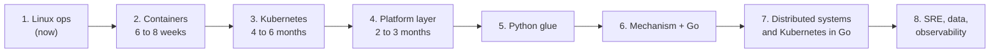

# 🗺️ Learning Roadmap

> [!abstract] Mission
> SRE / Platform Engineer. Go as the real programming language, Python and Bash as the scripting layer. Target depth: Linux kernel primitives, containers, Kubernetes, distributed systems, observability.

> [!info] How books are tiered
> - 🔥 **Deep**: read closely, notes for mental models
> - 🎯 **Selective**: read the chapters that serve the mission, skip the rest
> - 🔨 **Build along**: do it once, hands on, one note at the end
> - 📖 **Reference**: lookup only, a note only when a task pulls one out
> - 👀 **Skim**: one pass for the map, no notes
> - ⛔ **Skip**: listed so the question is not reopened

---

## 📍 Where things stand

> [!todo] Now: UNIX and Linux System Administration Handbook, 5th Edition
> Part 1 (Basic Administration, chapters 1 to 12) done, entering Part 2 (Networking). Roughly a third of the pages. 20 notes cover booting and systemd, access control, process control, the filesystem, scripting, logging, capabilities and namespaces.

> [!warning] Gaps in Part 1 worth a note before moving on
> - **Drivers and the Kernel** (`/proc`, `/sys`, `sysctl`, modules, `dmesg`): Tier 1 for SRE and the bridge into OSTEP and The Linux Programming Interface. No note yet.
> - **Software Installation and Management** (apt/dnf, repos, pinning): Tier 2, interview-relevant. No note yet.

### Chapter map for the rest of the handbook
- 🔥 **Deep, notes**: TCP/IP Networking (13), DNS (16, resolution model and failure modes, skip deep BIND config), Storage (20), Containers (25), Security (27), Monitoring (28), Performance Analysis (29)
- 🎯 **Selective, one model note each**: IP Routing (15), NFS (21), Configuration Management (23), Virtualization (24), CI/CD (26)
- 👀 **Skim**: Physical Networking (14), Single Sign-On (17), Web Hosting (19), Data Center Basics (30), Methodology and Politics (31)
- ⛔ **Skip**: Electronic Mail (18), SMB (22)

---

## 📚 The path

> [!note] Order changed on 2026-09-08
> Containers and Kubernetes come straight after the handbook, the programming phases follow.
> **Reason:** the target role is Platform Engineer, and a year of operating clusters makes the Go and Kubebuilder phases land better.
> **Cost:** Go moves out by roughly a year. Unlike Python, none of the container work can be drilled on the Windows work machine unless Docker Desktop or WSL2 is allowed there.

### Phase 1: Operations and the command line (now)

- 🔥 **UNIX and Linux System Administration Handbook, 5th Edition** (Nemeth, Snyder, Hein, Whaley, Mackin)
	- The operator's map of the machine. Chapter map above.
- 🎯 **A Practical Guide to Linux Commands, Editors, and Shell Programming, 4th Edition** (Sobell, Helmke)
	- Command drilling. Overlaps chapters 5 and 7 of the handbook, expect few notes.

### Phase 2: Containers (6 to 8 weeks)

> [!success] Goal
> Fluent with `docker` at a blank terminal, and able to explain a container as a process with namespaces, cgroups, capabilities and an overlay root filesystem. The handbook's Containers chapter (25) is the hand-off point.

- 🔥 **Docker Deep Dive, 2025 Edition** (Nigel Poulton), drill along
	- Fluency plus the engine architecture: daemon, containerd, shim, runc, OCI.
	- Read: engine, images, containers, containerizing apps, Compose. Skip: Swarm, Model Runner, Wasm.
- 🔥 **Container Security, 2nd Edition** (Liz Rice, O'Reilly, 2025), notes
	- The mechanism book: namespaces, cgroups, capabilities, seccomp, overlayfs, rootless, building a container by hand.
	- Does for containers what the handbook did for Linux. Links to [[Linux Namespaces]], [[Linux Capabilities]], [[Mandatory Access Control]].
- 🎯 **Containerd From The Bottom Up** (free, thecontainerdbook.com, in progress)
	- OCI bundles, runc lifecycle, the runtime v2 shim, containerd, CRI, CNI: the layer between Docker and Kubernetes.
- 🎯 **Podman in Action** (Dan Walsh, Manning, 2023), optional
	- Rootless containers and containers as systemd units, from the Red Hat Podman lead. Only if the work environment is RHEL-flavoured.

### Phase 3: Kubernetes (4 to 6 months)

> [!success] Goal
> Fluent with `kubectl` under time pressure, and able to explain what the control plane does with every object. The CKA exam at the end is the external check on "fluid in the shell".

- 🔥 **Kubernetes in Action, 2nd Edition** (Marko Lukša, Kevin Conner, Manning, March 2026), notes
	- The anchor. API-first: every object explained by what the control plane does with it.
- 🔥 **Certified Kubernetes Administrator (CKA) Study Guide, 2nd Edition** (Benjamin Muschko, O'Reilly, February 2026), drill along
	- Aligned with the 2025 exam overhaul: CRDs and Operators, Gateway API, Helm, Kustomize.
	- Read in parallel with Kubernetes in Action, topic by topic, with killercoda scenarios.
- 🔨 **Kubernetes The Hard Way** (Kelsey Hightower, free, 2025 update: Kubernetes v1.32, containerd v2.1, etcd v3.6)
	- Every certificate and systemd unit by hand, right after the architecture chapters. One note on the control plane boot sequence.
- 🎯 **Core Kubernetes** (Jay Vyas, Chris Love, Manning, 2022)
	- Control plane, kubelet, iptables and IPVS, CNI, CSI. Internals are stable, tool chapters are dated.
- 🎯 **Networking and Kubernetes: A Layered Approach** (James Strong, Vallery Lancey, O'Reilly, 2021)
	- Linux network primitives up to CNI, kube-proxy, Services, Ingress. Predates Gateway API and eBPF dataplanes, supplement with Cilium docs.
- ⛔ **The Kubernetes Book, 2025/2026 Edition** (Nigel Poulton)
	- Same ground as Kubernetes in Action, shallower. At most a one-week orientation with no notes.
- ⛔ **Kubernetes: Up and Running, 3rd Edition** (2022)
	- No 4th edition, overlaps and is older.

### Phase 4: The platform layer (2 to 3 months)

> [!success] Goal
> Know the decisions a platform team makes and ship one small platform end to end: kind or k3s cluster, Terraform for the infra, a Helm chart, Argo CD syncing it, Prometheus scraping it.

- 🎯 **Production Kubernetes: Building Successful Application Platforms** (Rosso, Lander, Brand, Harris, O'Reilly, 2021)
	- The catalogue of platform decisions and their trade-offs: topology, ingress, identity, secrets, multi-tenancy, admission, upgrades.
- 🎯 **Platform Engineering on Kubernetes** (Mauricio Salatino, Manning, 2024)
	- An internal platform built from Helm, Argo CD, Tekton, Crossplane, Knative, Dapr. Read for the shape, the tools will churn.
- 🎯 **Terraform: Up and Running, 3rd Edition** (Yevgeniy Brikman, O'Reilly, 2022)
	- Infrastructure as code. No 4th edition, transfers to OpenTofu.
- 🎯 **Argo CD in Practice** (Costea, Economakis, Packt, 2022) or **GitOps Cookbook** (Vinto, Soto Bueno, O'Reilly, 2022), pick one
	- GitOps delivery. Helm and Kustomize from the official docs and the CKA guide.
- 📖 **Kubernetes Patterns, 2nd Edition** (Ibryam, Huss, O'Reilly, 2023) and **Kubernetes Best Practices, 2nd Edition** (Burns, Villalba, Strebel, Evenson, O'Reilly, 2024)
	- Look up when a design question comes up.
- 👀 **Platform Engineering: A Guide for Technical, Product, and People Leaders** (Camille Fournier, Ian Nowland, O'Reilly, 2024)
	- How platform teams are judged. Organisational, not technical.
- 📖 **Certified Kubernetes Security Specialist (CKS) Study Guide** (Muschko, O'Reilly, 2023) and **Kubernetes Security and Observability** (Tigera, free)
	- When security work comes up.

> [!example]- Full research behind phases 2 to 4
> Verdicts on the rejected books, what platform engineer postings ask for, timing and trade-offs: [[Containers and Kubernetes Path Research]].

### Phase 5: Python as glue (drill at work)

> [!tip] Why Python is on the list at all
> Python runs on the Windows work machine; Bash and systemd drills do not. It is the language that can be practised in a spare ten minutes at work.

- 🔥 **Effective Python: 125 Specific Ways to Write Better Python, 3rd Edition** (Brett Slatkin, November 2024, covers Python 3.13)
	- The gotcha book, produces flashcards.
- 🎯 **Python for DevOps: Learn Ruthlessly Effective Automation** (Gift, Behrman, Deza, Gheorghiu, O'Reilly, 2019)
	- The only DevOps-shaped Python book with wide adoption, no 2nd edition exists.
	- Read the shell, subprocess, testing and packaging chapters. Skim the tooling chapters, they are aging.
- 📖 **Python Testing with pytest, 2nd Edition** (Brian Okken, 2022)
	- When scripts need tests.
- ⛔ **Automate the Boring Stuff with Python, 3rd Edition** (Al Sweigart, April 2025, free online)
	- On-ramp, already past it. Skip unless a refresher is wanted.

### Phase 6: Mechanism, with Go in parallel

> [!tip] Two tracks, one concept at a time
> Reading about signals and then writing a Go server that shuts down cleanly on `SIGTERM` is one concept, not two.

**Theory track**
- 👀 **The C Programming Language, 2nd Edition** (Kernighan, Ritchie), two weeks
	- Reading skill for the books below.
- 🔥 **Operating Systems: Three Easy Pieces** (Remzi and Andrea Arpaci-Dusseau, free online)
	- Virtualization, concurrency, persistence.
- 🎯 **The Linux Programming Interface** (Michael Kerrisk, 2010, no 2nd edition exists)
	- Processes, signals, file I/O, sockets. Skip the parts a Go SRE will never touch.
- 🎯 **Computer Systems: A Programmer's Perspective, 3rd Edition** (Bryant, O'Hallaron)
	- Memory, caches, linking, performance. Swap in Dive Into Systems if it stalls.

**Go track, in this order**
- 🔥 **Learning Go: An Idiomatic Approach to Real-World Go Programming, 2nd Edition** (Jon Bodner, January 2024, Go 1.21 and 1.22, generics, new tooling chapter, exercises)
	- The language, written for developers converting from another language. Tests arrive late (chapter 13), read that chapter early.
- 🔥 **100 Go Mistakes and How to Avoid Them** (Teiva Harsanyi, Manning, 2022, companion site 100go.co)
	- Gotcha catalogue, strong on concurrency. Flashcard-shaped.
- 🔨 **Let's Go Further** (Alex Edwards, self-published, kept current, Go 1.25)
	- A JSON API with the standard library: the first real service, with graceful shutdown, metrics, auth.

### Phase 7: Distributed systems and Kubernetes in Go

- 🔥 **Cloud Native Go: Building Reliable Services in Unreliable Environments, 2nd Edition** (Matthew A. Titmus, October 2024)
	- Builds a distributed key-value store. New chapters on security and distributed state.
- 🔨 **The Kubebuilder Book** (free, official Kubernetes SIG project, maintained)
	- CRDs, controllers, operators: the actual "Kubernetes extensions" path.
- 📖 **Kubernetes Programming with Go** (Philippe Martin, Apress, 2022)
	- Deeper on client-go and the API machinery when the Kubebuilder Book is not enough.
- 🎯 **Network Programming with Go** (Adam Woodbeck, No Starch, 2021)
	- TCP, UDP, Unix sockets, TLS in Go. The networking chapters of The Linux Programming Interface done in Go.
- 📖 **Go for DevOps** (John Doak, David Justice, Packt, 2022)
	- Ex-Google SRE authors. Automation, GitHub Actions, Terraform. Aging, use per chapter when a task matches.

> [!note] Data structures and algorithms
> There is no strong Go-specific book. Use language-agnostic interview practice solved in Go instead.

### Phase 8: SRE, data, observability, security

- 🔥 **Designing Data-Intensive Applications, 2nd Edition** (Martin Kleppmann, Chris Riccomini, O'Reilly, early 2026)
	- Buy the 2nd edition, not the 1st.
- 🎯 **Site Reliability Engineering**, **The Site Reliability Workbook**, **Building Secure and Reliable Systems** (Google, all free at sre.google/books)
	- The SRE canon. Replaces the Packt Practical Site Reliability Engineering book.
- 🔥 **Efficient Go: Data-Driven Performance Optimization** (Bartłomiej Płotka, O'Reilly, 2022, Prometheus maintainer, ex-SRE)
	- Performance through observability: pprof, benchstat, k6, Prometheus, continuous profiling. Written for SRE and platform people.
- 🎯 **Learning OpenTelemetry** (Ted Young, Austin Parker, O'Reilly, 2024, project founders) and **Cloud-Native Observability with OpenTelemetry** (Alex Boten, Packt, 2022, Python and Go code)
	- Learning OpenTelemetry is the architecture with no code, the Boten book is hands-on. Read the first, keep the second for the code.
- 🎯 **Threat Modeling: Designing for Security** (Adam Shostack, 2014)
	- Still the canonical text.

---

> [!question]- Why Go, and how this path relates to the original staff engineer list
> The original list is a **systems programmer's** ladder: The C Programming Language, then the kernel's C interface (Advanced Programming in the UNIX Environment, The Linux Programming Interface, System Programming Vol I and Vol II), then the machine and the OS (Computer Systems: A Programmer's Perspective, Operating Systems: Three Easy Pieces, Dive Into Systems), then Rust as the modern systems language, then SRE, observability, and Designing Data-Intensive Applications. Its identity is "the person who writes the thing underneath the infrastructure".
>
> Go is absent from that list because Go is not a systems language in that sense (garbage collected, no manual memory). Go is the **infrastructure** language: Kubernetes, Docker, containerd, etcd, Prometheus, Terraform are all Go. For SRE and Platform work, Go is the pragmatic choice. Rust stays a far-future option for performance-critical components.
>
> What that means for this path:
> - **Go replaces the Rust block** (seven books) as the "apply the foundation" language.
> - **C survives as a reading skill, not a writing skill.** The Linux Programming Interface, Advanced Programming in the UNIX Environment and Computer Systems: A Programmer's Perspective are written in C. The C Programming Language is 270 pages; read it once to be able to read the others. Go's `golang.org/x/sys/unix` mirrors the C syscall API one to one, so exercises from The Linux Programming Interface can be done in Go.
> - **Dropped from the original list, and why:** Advanced Programming in the UNIX Environment (overlaps The Linux Programming Interface, which is Linux-specific and the one to keep), System Programming Vol I and Vol II (Jin-Jwei Chen, self-published C across many UNIX flavours, overlaps The Linux Programming Interface), Linux for Networking Professionals (Part 2 of the handbook covers it), Practical Site Reliability Engineering (Packt 2018, scattershot: Spring Boot, Ballerina and Rust in one book; the free Google SRE books replace it), Data Observability for Data Engineering (data engineering, not SRE), Linux and the Unix Philosophy (a good read, not foundational).
> - **Dive Into Systems** is free online and is the gentler Computer Systems: A Programmer's Perspective. If the latter stalls, swap it in.

---

## 🔗 Related
- [[Containers and Kubernetes Path Research]]
- [[Dor-Brain AI Instructions & Operating Guide]]
- [[Flashcard System & Memory Guide]]
- [[Drill Protocol]]
