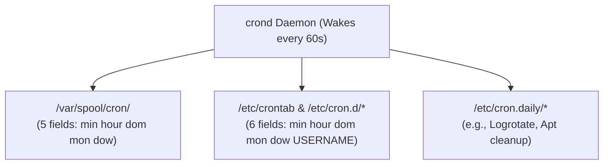

# Cron & Periodic Processes

## 🧠 The Core Concept
- **What is it?** `crond` is a background daemon that wakes up every minute to check and execute scheduled jobs (cron tasks) based on calendar and time expressions.
- **User Crontabs vs. System Crontabs:**
  - **User Crontabs (`/var/spool/cron/`):** Owned by individual users, managed exclusively via `crontab -e` / `crontab -l`. Follows the standard **5-field** time format.
  - **System Crontabs (`/etc/crontab` and `/etc/cron.d/`):** System-wide administrative tables that include an explicit **`username`** column (**6-field** format).
  - **Periodic System Directories:** Scripts placed in `/etc/cron.hourly/`, `/etc/cron.daily/`, `/etc/cron.weekly/`, and `/etc/cron.monthly/` run automatically without manual timing configuration (commonly used by [[Logrotate]]).



---

## 💻 Syntax & Minimal Example

### 1. The 5-Field Time Specification
```text
┌───────────── Minute (0 - 59)
│ ┌───────────── Hour (0 - 23)
│ │ ┌───────────── Day of Month (1 - 31)
│ │ │ ┌───────────── Month (1 - 12)
│ │ │ │ ┌───────────── Day of Week (0 - 7, 0 and 7 = Sunday)
│ │ │ │ │
* * * * *  <command_to_execute>
```

### 2. Production Crontab Template with Environment Headers
```bash
# Set explicit environment variables at the top:
SHELL=/bin/bash
PATH=/usr/local/bin:/usr/bin:/bin
MAILTO=""

# 1. Run database backup every night at 02:30 with full output logging:
30 2 * * * /usr/local/bin/db_backup.sh >> /var/log/backup.log 2>&1

# 2. Run queue worker every 5 minutes protected by flock to prevent overlapping:
*/5 * * * * flock -n /var/lock/worker.lock /usr/local/bin/process_queue.sh >> /var/log/queue.log 2>&1

# 3. Run cache warmup once at system startup:
@reboot /usr/local/bin/warm_cache.sh
```

---

## ⚠️ Common Pitfalls & SRE Gotchas

- **Environment Variable Amnesia ($PATH & SHELL):** Cron spawns non-interactive subshells (`/bin/sh`) with a minimal default `PATH=/usr/bin:/bin`. It does **not** load `.bashrc`, `.profile`, or user environment variables. Always specify absolute binary paths or declare `PATH=` and `SHELL=` at the top of the crontab.
- **The Cascading Overlap Avalanche:** Cron is stateless; if a job scheduled every 5 minutes stalls and takes 15 minutes, cron will spawn multiple concurrent instances. Always wrap frequent jobs with **`flock -n <lockfile> <command>`** to ensure single-instance execution.
- **Silent Failures & Missing MTA:** Un-redirected `stdout` and `stderr` are sent to local mail (`sendmail`). In cloud environments without an MTA configured, job errors disappear silently. Always append output to a log file (`>> /var/log/... 2>&1`).
- **The Missing Username in `/etc/cron.d/`:** Adding a line to `/etc/crontab` or `/etc/cron.d/` without the 6th `username` column causes cron to interpret the username as the executable command, failing instantly.

---

## 🔗 Connections (Mental Mapping)
- **Log Management:** [[Logrotate]] (Periodic log compression scheduled via `/etc/cron.daily/`)
- **Process Lifecycle:** [[Process Control]]
- **Triage & Incidents:** [[Runaway Processes]] (Overlapping cron jobs causing CPU/Memory starvation)
- **Supervisor Daemons:** [[Daemons]]

---

## ⚡ Active Recall Flashcards

What is the 5-field timing format used in user crontabs?::`min (0-59) hour (0-23) dom (1-31) month (1-12) weekday (0-7)`
<!--SR:!fsrs,2026-09-17T15:29:29.817Z,14,13.82690327,2.11121424,2,2,0,0,2026-09-03T15:29:29.817Z-->

Why do scripts that run cleanly in your terminal often fail when executed by cron?::Cron runs in a minimal subshell without loading user `.bashrc` or custom `$PATH` environment variables
<!--SR:!fsrs,2026-09-17T15:30:20.889Z,14,13.82690327,2.11121424,2,2,0,0,2026-09-03T15:30:20.889Z-->

How can an SRE prevent overlapping concurrent runs of a frequent cron job?::Wrap the command in `flock -n /var/lock/job.lock <script>` so subsequent runs exit immediately if the lock is held
<!--SR:!fsrs,2026-09-17T15:29:23.887Z,14,13.82690327,2.11121424,2,2,0,0,2026-09-03T15:29:23.887Z-->

What extra field is required in `/etc/crontab` and `/etc/cron.d/*` compared to user crontabs?::The `username` column (specifies which user executes the command)
<!--SR:!fsrs,2026-09-17T15:30:10.397Z,14,13.82690327,2.11121424,2,2,0,0,2026-09-03T15:30:10.397Z-->

What happens by default to un-redirected stdout/stderr produced by a cron job?::Cron attempts to email the output to the user via the local system mail transfer agent (MTA)
<!--SR:!fsrs,2026-09-03T15:40:00.559Z,0,8.04317602,5.10228691,1,2,0,1,2026-09-03T15:30:00.559Z-->
