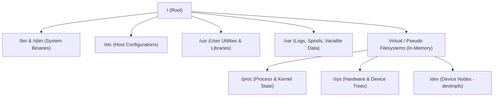

# Filesystem Hierarchy and Permissions

## 🧠 The Core Concept
The Linux filesystem serves four foundational roles:
1. **A Namespace:** A single, unified hierarchical tree starting at root (`/`) rather than drive letters (like `C:\`).
2. **An API:** Standardized POSIX system calls (`open`, `read`, `write`, `close`, `stat`, `unlink`) that make storage, devices, network sockets, and kernel data structures look and behave like files ("everything is a file").
3. **A Security Model:** Access control matrices consisting of Ownership (User, Group), Permission bits (`r`, `w`, `x`), and Special modes (SUID, SGID, Sticky bit).
4. **An Implementation:** Drivers that map filesystem requests to underlying storage blocks (e.g. ext4, XFS, Btrfs, NFS).



### 1. Filesystem Types: Storage vs. Pseudo Filesystems
- **Disk-backed Filesystems (Persistent):** Formatted on block devices or logical volumes (e.g. `ext4`, `xfs`, `btrfs`). They store actual data blocks and metadata (inodes) on physical disks.
- **Pseudo / Virtual Filesystems (RAM-backed):** In-memory kernel data structures exposed as directories and files. They consume zero physical disk space.
  - `/proc`: Exposes kernel data structures, process metrics, and file descriptors (`/proc/<PID>/fd`).
  - `/sys`: Exposes kernel subsystems, hardware devices, drivers, and cgroups.
  - `/dev`: Exposes device interfaces (`devtmpfs`) representing disks (`/dev/sda`), terminals (`/dev/pts`), and null sinks (`/dev/null`).
  - `/run`: Volatile runtime data (PIDs, Unix domain sockets) mounted on `tmpfs`.

### 2. Filesystem Hierarchy Standard (FHS) Quick Reference
- `/boot`: Kernel images (`vmlinuz`), initramfs, and bootloader configuration.
- `/etc`: Host-specific startup configuration and text config files.
- `/home` & `/root`: Default home directories for non-privileged users and the superuser.
- `/media` & `/mnt`: Mount points for removable media and manual temporary mounts.
- `/opt`: Add-on third-party application software packages.
- `/tmp`: Temporary scratch space accessible to all users (guarded by the Sticky bit).
- `/usr`: Secondary read-only user hierarchy (`/usr/bin`, `/usr/lib`, `/usr/local`, `/usr/share`).
- `/var`: Variable data that changes during system operation (`/var/log`, `/var/spool`, `/var/tmp`).

---

## 🛡️ Permission Bits & Access Control

Every filesystem object has 9 standard permission bits divided into three sets:
1. **User / Owner (`u`):** Permissions for the user account owning the file.
2. **Group (`g`):** Permissions for members of the group owning the file.
3. **Others (`o`):** Permissions for everyone else on the system.

### 1. Octal Representation (Base 8)
Each permission has a numeric value based on its binary position:
- **Read (`r`):** `4` (Binary `100`)
- **Write (`w`):** `2` (Binary `010`)
- **Execute (`x`):** `1` (Binary `001`)

Combining these values yields octal digits from `0` to `7`:
- `7` (`rwx`) = `4 + 2 + 1` (Full access)
- `6` (`rw-`) = `4 + 2 + 0` (Read + Write)
- `5` (`r-x`) = `4 + 0 + 1` (Read + Execute)
- `4` (`r--`) = `4 + 0 + 0` (Read only)
- `0` (`---`) = `0 + 0 + 0` (No access)

### 2. Directory Permissions vs. Regular File Permissions
Permissions carry distinct operational meanings for directories compared to regular files:

| Permission | On a Regular File | On a Directory |
| :--- | :--- | :--- |
| **`r` (Read)** | Read contents of the file (`cat`, `less`) | List filenames inside directory (`ls`) |
| **`w` (Write)** | Modify or truncate file content | Create, rename, or delete filenames inside |
| **`x` (Execute)** | Run file as a compiled binary or script | Traverse / search directory (`cd`, access inodes & metadata) |

> [!IMPORTANT]
> **The Directory `x` Rule:** Without the `x` bit on a directory, you cannot `cd` into it, inspect file metadata (`ls -l`), or read files inside, even if the file itself has `r` permissions (`-rwxrwxrwx`).

### 3. Special Permissions (The 4th Octal Digit)
- **SUID (`4000` / `u+s`):** Runs executable with the file owner's privileges (e.g. `/usr/bin/passwd`).
- **SGID (`2000` / `g+s`):** On binaries, runs with group permissions. On directories, newly created files inherit the parent directory's group.
- **Sticky Bit (`1000` / `+t` / `o+t`):** On directories (like `/tmp`), users can create files, but only the file owner or `root` can delete or rename them.

### 4. Default Permissions & `umask`
When a process creates a file or directory, the kernel applies the process `umask` (user mask) to strip forbidden permission bits:
- **Base Directory Mode:** `0777` (`rwxrwxrwx`)
- **Base File Mode:** `0666` (`rw-rw-rw-`)
- **Formula:** `Final Permissions = Base Mode & (~umask)`

Example with default `umask 022`:
- New Directory: `0777 - 0022 = 0755` (`drwxr-xr-x`)
- New File: `0666 - 0022 = 0644` (`-rw-r--r--`)

---

## 💻 Syntax & Commands Reference

### 1. Modifying Permissions (`chmod`)
```bash
# Octal syntax (standard 3 digits):
chmod 755 script.sh          # rwxr-xr-x
chmod 644 config.yaml        # rw-r--r--

# Octal syntax with special bit (4 digits):
chmod 1777 /shared_tmp       # drwxrwxrwt (Sticky bit)
chmod 2775 /srv/team_dir     # drwxrwsr-x (SGID on directory)

# Mnemonic (symbolic) syntax:
chmod u+x run.sh             # Add execute for owner
chmod g+w,o-r file.txt       # Add group write, remove others read
chmod a-w document.pdf       # Remove write for all (user, group, other)
chmod g=u project/           # Set group permissions identical to owner
```

### 2. Changing Ownership (`chown` & `chgrp`)
```bash
# Change owner only:
chown appuser /var/log/app.log

# Change owner and group simultaneously:
chown appuser:appgroup /srv/app

# Change ownership recursively:
chown -R www-data:www-data /var/www/html
```

### 3. Inspecting Filesystems & Inodes
```bash
# Inspect mounted filesystems, types, and mount options:
findmnt
mount | grep ext4

# Check disk space usage vs inode capacity:
df -h                        # Human-readable disk block usage
df -i                        # Inode table usage (identifies inode exhaustion)

# Inspect exact numeric octal permissions:
stat -c "%a %n" /etc/passwd  # Returns "644 /etc/passwd"
```

---

## ⚠️ Common Pitfalls (The "Gotchas")

### 1. Deleting Read-Only Files in Writable Directories
- **The Gotcha:** A normal user can delete a root-owned file marked `-r--------` if the user has write and execute permissions on the **parent directory**.
- **The Reason:** Deleting a file (`rm`) does not modify the file itself; it modifies the parent directory table by unlinking the name entry from the inode.
- **The Guard:** Apply the Sticky bit (`chmod +t`) on multi-user directories like `/tmp`.

### 2. `df` vs `du` Mismatch (Open Deleted Files)
- **The Symptom:** `df -h` shows a mount point at 100% full, but `du -sh *` accounts for only a fraction of that space.
- **The Root Cause:** A process holds an open file descriptor to a large file that was deleted via `rm`. The filesystem removes the directory link (`unlink`), but the physical disk blocks remain allocated until the process closes the file descriptor or terminates.
- **Production Triage:**
  ```bash
  # 1. Locate open deleted files:
  lsof +L1
  lsof | grep '(deleted)'

  # 2. Free space immediately without killing the process by truncating via /proc:
  > /proc/<PID>/fd/<FD_NUMBER>
  ```

### 3. Inode Exhaustion (0 Bytes Free Despite Available Disk Space)
- **The Symptom:** Applications fail with `No space left on device`, but `df -h` shows ample gigabytes free.
- **The Root Cause:** Millions of tiny files (e.g. session tokens, temporary cache files) have consumed all allocated inodes in the filesystem table.
- **Verification:** Run `df -i` to check `IUse%`.

---

## 🔗 Connections (Mental Mapping)
- **Special Elevation Bits:** [[SUID and SGID]]
- **Fine-Grained Privilege Division:** [[Linux Capabilities]]
- **System Service Logging & Rotation:** [[Logrotate]]
- **Process I/O & File Descriptors:** [[Process Control]]
- **Security Contexts & Root Powers:** [[Access Control and Rootly Powers]]

---

## ⚡ Active Recall Flashcards

What is the difference between read (r) and execute (x) permissions on a Linux directory?::Read allows listing filenames with ls, while execute allows traversing the directory to access file contents, inspect inodes, or cd inside
<!--SR:!fsrs,2026-09-17T15:31:07.290Z,14,13.82690327,2.11121424,2,2,0,0,2026-09-03T15:31:07.290Z-->

Why can an unprivileged user delete a root-owned read-only file inside a world-writable directory?::Deleting a file modifies the parent directory's table of entries, which requires write permission on the directory rather than the file
<!--SR:!fsrs,2026-09-17T15:31:11.414Z,14,13.82690327,2.11121424,2,2,0,0,2026-09-03T15:31:11.414Z-->

Why does running rm on a large active log file fail to reclaim disk space in df?::The file has open file descriptors held by a running process; disk blocks are freed only when hard link count and open file descriptors reach zero
<!--SR:!fsrs,2026-09-17T15:30:32.984Z,14,13.82690327,2.11121424,2,2,0,0,2026-09-03T15:30:32.984Z-->

How does the Linux kernel calculate default file permissions from umask on creation?::It takes the base creation mode (0666 for files, 0777 for directories) and masks out bits specified in umask via bitwise NOT
<!--SR:!fsrs,2026-09-03T15:37:02.160Z,0,5.35259572,6.74045952,1,2,0,0,2026-09-03T15:31:02.160Z-->

What is the primary difference between disk filesystems (ext4, XFS) and pseudo filesystems (/proc, /sys)?::Disk filesystems store persistent data blocks on physical media, while pseudo filesystems are virtual RAM-backed kernel data structures exposing runtime state
<!--SR:!fsrs,2026-09-03T15:40:46.395Z,0,8.04317602,5.10228691,1,2,0,1,2026-09-03T15:30:46.395Z-->
