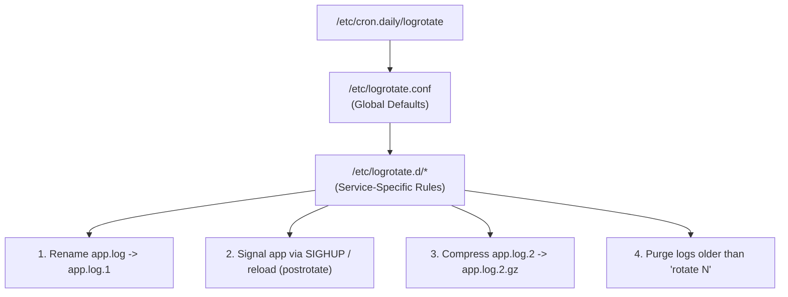

# Logrotate & Log Management

## 🧠 The Core Concept
- **What is it?** `logrotate` is a Linux system utility designed to automate the archiving, compression, rotation, and removal of log files to prevent storage drives from reaching 100% capacity.
- **How it runs:** `logrotate` is **not** a continuous background daemon. It is invoked periodically by [[Cron]] (via `/etc/cron.daily/logrotate`) or a systemd timer.
- **Configuration Hierarchy:**
  - **Global Defaults:** `/etc/logrotate.conf` (sets system-wide defaults like weekly rotation and gzip compression).
  - **Service Drop-in Directory:** `/etc/logrotate.d/` (service-specific policies, e.g. `/etc/logrotate.d/nginx`, `/etc/logrotate.d/myapp`).



---

## 💻 Configuration & Real-World Example

### Annotated Production Config (`/etc/logrotate.d/myapp`)
```text
/var/log/myapp/*.log {
    daily                       # Rotate logs every 24 hours
    rotate 7                    # Retain 7 rotated archives before purging oldest
    missingok                   # Do not throw errors if log file is missing
    notifempty                  # Do not rotate if file is 0 bytes
    compress                    # Compress rotated files using gzip
    delaycompress               # Delay compression of .1 file until next cycle
    sharedscripts               # Run postrotate script only once per batch
    postrotate
        /usr/bin/systemctl reload myapp > /dev/null 2>&1 || true
    endscript
}
```

---

## 🔍 The File Descriptor Dilemma: `postrotate` vs. `copytruncate`

Linux processes write to an **open file descriptor pointing to an inode**, not a filename string. When `logrotate` renames `app.log` $\rightarrow$ `app.log.1`, the running process will continue writing to `app.log.1` unless instructed otherwise.

| Strategy | Mechanism | Best For | Gotchas |
| :--- | :--- | :--- | :--- |
| **`postrotate` + Signal** | Renames file, creates new empty `app.log`, and sends `SIGHUP` (or `systemctl reload`) to process. | Production daemons (Nginx, Apache, custom Go/Java apps supporting reloads). | App must implement signal reload handling. |
| **`copytruncate`** | Copies content to `app.log.1`, then truncates active `app.log` in-place to 0 bytes (`> app.log`) without changing inodes. | Legacy or third-party apps that cannot reload file descriptors live. | **Micro Race Condition:** Log lines written during the exact millisecond between copy and truncate can be lost. |

---

## 🛠️ Incident Triage & Diagnostic Commands

```bash
# 1. Dry-run / Debug mode (Tests config syntax & prints planned actions without touching disk):
sudo logrotate -d /etc/logrotate.conf

# 2. Verbose Force mode (Forces immediate rotation of all logs; triage disk-full emergencies):
sudo logrotate -vf /etc/logrotate.conf

# 3. Check when logrotate last processed a specific file:
cat /var/lib/logrotate/status | grep myapp
```

---

## ⚠️ Common Pitfalls & SRE Gotchas

- **The Missing Reload Trap:** If an app does not support `copytruncate` and lacks a `postrotate` reload script, it will continue dumping gigabytes into the renamed `.1` file, never releasing disk blocks.
- **Permissions on Newly Created Logs (`create` directive):** If logrotate creates a new empty log file owned by `root:root` with mode `0600`, an unprivileged service account (e.g. `www-data` or `app`) will crash with `Permission Denied` when writing. Use `create 0640 app app`.
- **`df` vs. `du` Discrepancy on Deletion:** Deleting an active un-rotated log file manually with `rm` does not free disk space while the process holds the open file descriptor. Always use `logrotate -vf` or truncate via `/proc/<PID>/fd/` during incidents.

---

## 🔗 Connections (Mental Mapping)
- **Scheduling Daemon:** [[Cron]] (Invokes logrotate daily via `/etc/cron.daily/`)
- **Process Signals & File Descriptors:** [[Process Control]] (`SIGHUP` signal handling and `/proc/<PID>/fd`)
- **Incident Troubleshooting:** [[Runaway Processes]] (Diagnosing disk saturation and unlinked open files)
- **Service Supervision:** [[systemctl]] (`systemctl reload` inside `postrotate`)

---

## ⚡ Active Recall Flashcards

Why does logrotate use a `postrotate` script with `SIGHUP` or reload after renaming a log file?::Linux processes write to inodes; signaling forces the app to close the old file descriptor and open the newly created log file
<!--SR:!fsrs,2026-08-31T14:29:25.936Z,0,2.3065,2.11810397,1,1,0,1,2026-08-31T14:19:25.936Z-->

What does the logrotate directive `copytruncate` do, and when is it used?::Copies the log file and truncates the original in-place to 0 bytes without changing inodes; used for apps that cannot reload file descriptors on SIGHUP

Which command tests logrotate configuration syntax in dry-run mode without modifying any files?::`sudo logrotate -d /etc/logrotate.conf`

Which command forces logrotate to rotate all log files immediately during a disk space incident?::`sudo logrotate -vf /etc/logrotate.conf`
<!--SR:!fsrs,2026-08-31T14:25:37.177Z,0,1.2931,5.11217071,1,1,0,0,2026-08-31T14:19:37.177Z-->
