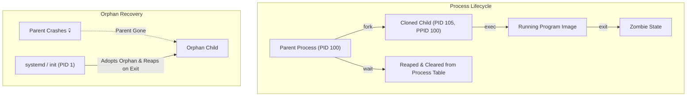
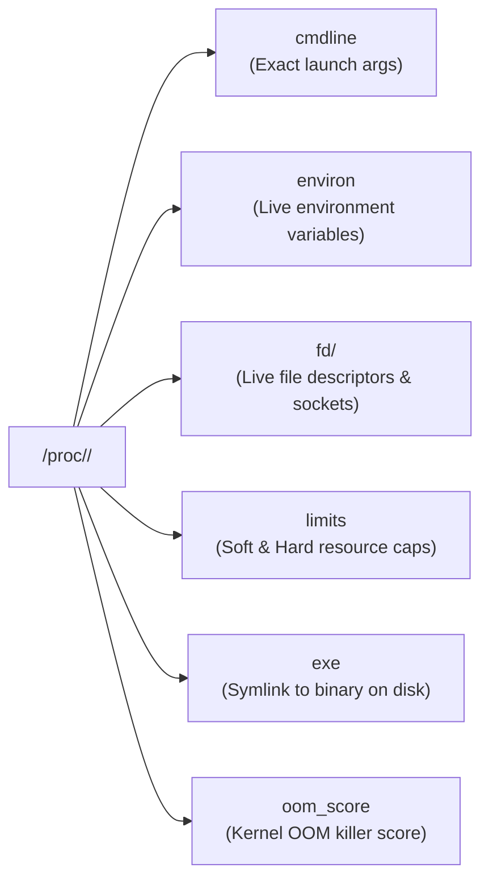

# Process Control

## 🧠 The Core Concept
- **What is a Process?** An isolated running program. It is the kernel abstraction that manages virtual memory address space, CPU time allocation, file descriptors, network sockets, and execution state.
- **Process vs. Thread:** A process provides the isolated memory sandbox. Threads run inside that process, sharing its memory and resources while executing concurrently across multiple CPU cores.
- **The Fork & Exec Lifecycle:** Linux creates new processes in two stages:
  1. `fork()`: An existing process clones itself into a child process (inheriting memory, environment, and file descriptors).
  2. `exec()`: The cloned child replaces its memory image with a new binary to begin executing new code.
- **Identity (UID vs. EUID & GID vs. EGID):**
  - **Real UID (`UID`):** Who actually launched the process (the user's true identity/badge).
  - **Effective UID (`EUID`):** The identity the kernel inspects when deciding file and resource permissions (the active role/hat).
  - **Saved UID (`SUID`):** Enables a process with elevated permissions (like [[SUID and SGID]]) to drop privileges to a normal user and safely restore them only when strictly necessary.
- **Orphans vs. Zombies:**
  - **Orphan:** A running process whose parent died. The kernel re-parents the orphan to **`PID 1`** (`systemd`/`init`).
  - **Zombie (`<defunct>`):** A process that has finished execution, but whose parent has not yet called `wait()` to collect its exit code. It uses 0 CPU and 0 RAM, but retains an entry in the system process table.



---

## 💻 Syntax, Commands & Signal Management

### 1. Essential Signals & Triggers

| Signal Number | Signal Name | Trigger / Shortcut | Default Action | Catchable? | Purpose / Real-World Meaning |
| :--- | :--- | :--- | :--- | :--- | :--- |
| **`1`** | **`SIGHUP`** | Terminal disconnect | Terminate | **Yes** | **Daemon Config Reload:** Repurposed by daemons (Nginx, Apache) to reload configs without dropping traffic. |
| **`2`** | **`SIGINT`** | `Ctrl + C` | Terminate | **Yes** | **Keyboard Interrupt:** Polite request from interactive terminal to cancel current execution. |
| **`3`** | **`SIGQUIT`**| `Ctrl + \` | Dump Core | **Yes** | **Quit & Core Dump:** Terminates process and produces a memory dump for debugging. |
| **`9`** | **`SIGKILL`**| `kill -9` | Terminate | **NO** | **Forced Execution Kill:** Handled directly by kernel; process cannot catch, block, or clean up. |
| **`15`**| **`SIGTERM`**| `kill <PID>` | Terminate | **Yes** | **Graceful Shutdown (Default):** Polite termination request allowing cleanup of sockets/buffers. |
| **`17`**| **`SIGSTOP`**| Kernel | Stop | **NO** | **Forced Pause:** Suspends process execution immediately. |
| **`18`**| **`SIGTSTP`**| `Ctrl + Z` | Stop | **Yes** | **Terminal Stop:** Pauses process and moves it to background sleep. |
| **`19`**| **`SIGCONT`**| `kill -CONT` / `fg` | Ignore/Resume | **Yes** | **Continue:** Resumes a paused (`STOP` / `TSTP`) process. |

### 2. Process Monitoring & Decoding `ps aux`

#### Column-by-Column Decoder
| Column | Name | Meaning |
| :--- | :--- | :--- |
| **`USER`** | Owner | Username who owns and launched the process. |
| **`PID`** | Process ID | Unique process identifier number. |
| **`%CPU`** | CPU Usage | Percentage of **1 CPU core** currently being utilized. |
| **`%MEM`** | Memory Usage | Percentage of **total physical RAM** used. |
| **`VSZ`** | Virtual Size | Total virtual memory mapped in KiB (includes code, libs, and unallocated buffer promises). |
| **`RSS`** | Resident Set | Real, physical RAM currently occupied in KiB (the actual hardware RAM in use). |
| **`TTY`** | Terminal | Controlling terminal (`?` = background daemon / GUI subprocess without a terminal). |
| **`STAT`** | State Code | `R` (Running), `S` (Sleeping), `D` (Disk I/O Wait), `T` (Stopped), `Z` (Zombie), `l` (Multithreaded). |
| **`START`**| Start Time | Clock time or calendar date the process was launched. |
| **`TIME`** | Cumulative CPU | Total accumulated CPU computation time since startup (`HH:MM:SS`). |
| **`COMMAND`**| Executable | Binary name and arguments. Modern browsers/Electron apps produce huge argument strings. |

---

### 🛠️ How to Build Custom `ps` Commands from Scratch

Instead of suffering through 1000-character argument strings in `ps aux`, use the **3-Part Builder Formula**:

$$\Large \text{ps } \underbrace{\text{-e}}_{\text{Scope}} \ \underbrace{\text{-o col1,col2...}}_{\text{Columns (Format)}} \ \underbrace{\text{--sort=-col}}_{\text{Sorting}}$$

#### 1. Scope (Which processes to select)
- `-e` (or `-A`): Select **every** process on the system.
- `-u <username>`: Select processes owned by a specific user.
- `-C <binary_name>`: Select processes matching a specific command name (e.g., `ps -C nginx`).
- `-p <PID1,PID2>`: Select specific PIDs.

#### 2. Format / Columns (`-o <column_list>`)
| Specifier | What it Outputs | SRE Pro-Tip |
| :--- | :--- | :--- |
| **`comm`** | **Short Binary Name only** | **Cuts the wall of text!** Displays `firefox` instead of 500 characters of flags. |
| **`args`** (or `command`) | Full command line with all flags | Use when you need to inspect startup flags or tab IDs. |
| **`pid`, `ppid`** | Process ID & Parent Process ID | Trace parent-child hierarchies. |
| **`user`, `uid`** | Username or numeric user ID | |
| **`%cpu`, `%mem`** | Resource usage percentages | |
| **`rss`, `vsz`** | Physical RAM vs Virtual Address space | Both in KiB. |
| **`stat`** | Current process state codes | |
| **`etime`** | Elapsed wall-clock run time | Format: `[[dd-]hh:]mm:ss` (How long has this worker been alive?). |
| **`time`** | Cumulative CPU execution time | |

#### 3. Sorting (`--sort`)
- `--sort=-<column>` $\rightarrow$ Descending (highest first, e.g. `--sort=-%cpu`, `--sort=-rss`, `--sort=-time`).
- `--sort=+<column>` $\rightarrow$ Ascending (lowest first).

#### Practical Recipes:
```bash
# 1. Clean Top 5 CPU consumers (short binary names)
ps -eo pid,user,%cpu,%mem,comm --sort=-%cpu | head -n 6

# 2. Clean Top 5 Memory consumers with Parent PID
ps -eo pid,ppid,user,%mem,rss,comm --sort=-%mem | head -n 6

# 3. Find longest running processes (Elapsed time vs CPU time)
ps -eo pid,user,etime,time,comm --sort=-time | head -n 10

# 4. View process tree with ASCII hierarchy
ps -ef --forest
```

#### Process State Codes (`STAT` Column in `ps`)
- **`R` (Running/Runnable):** Actively executing on CPU or in the ready queue.
- **`S` (Interruptible Sleep):** Waiting for an event, timer, or user input; wakes on signals.
- **`D` (Uninterruptible Sleep):** Blocked in kernel space waiting for disk/network I/O; ignores signals.
- **`T` (Stopped/Traced):** Paused by signal (`Ctrl+Z`) or attached to a debugger (`gdb`/`strace`).
- **`Z` (Zombie):** Terminated process waiting for parent to read its exit code (`<defunct>`).

#### Load Average & Memory Metrics (`top`)
- **Load Average (1, 5, 15 min):** The average count of processes in **`R`** + **`D`** states. Compare against CPU core count (`nproc`):
  - *Load == Core count:* 100% CPU capacity.
  - *Load > Core count:* Processes are queuing/stalling in traffic.
  - *High Load + Low CPU % + High `%wa`:* Storage/Disk bottleneck (processes stuck in `D` state).
- **`VIRT` vs. `RES`:**
  - **`VIRT` (Virtual Image):** Total address space requested/mapped (code, libraries, unallocated buffer promises).
  - **`RES` (Resident Size):** Real, physical RAM currently occupied by the process.

---

## 🔍 SRE Diagnostics & The `/proc` Pseudo-Filesystem

The `/proc` filesystem resides **100% in kernel memory (RAM)**, costing 0 bytes of disk storage. It is the raw data source for `ps`, `top`, and `lsof`.



### High-Yield SRE Diagnostic Files

| File / Path | Purpose & Incident Investigation |
| :--- | :--- |
| **`/proc/<PID>/cmdline`** | Exact command line & arguments that launched the process. |
| **`/proc/<PID>/environ`** | Live environment variables injected at runtime. |
| **`/proc/<PID>/fd/`** | Directory of open file descriptors. Symlinks point to open files, pipes, and sockets. |
| **`/proc/<PID>/limits`** | Soft and hard limits (`Max open files`, `Max processes`). #1 check for `EMFILE: Too many open files`. |
| **`/proc/<PID>/exe`** | Direct symlink to the binary executable on disk. |
| **`/proc/<PID>/cwd`** | Symlink to the current working directory of the process. |
| **`/proc/<PID>/status`** | Human-readable process state, memory metrics (`VmRSS`, `VmSwap`), and thread counts. |

### Deep Diagnostic Tools (`lsof` & `strace`)
```bash
# 1. lsof: List Open Files across the system
lsof -i :80                           # Identify which process is listening on port 80
lsof -u dor                           # List all open files held by user 'dor'
lsof +D /var/log                      # Find processes locking files in /var/log

# 2. strace: Live System Call Tracer (Kernel X-Ray)
strace -p 1234                        # Live stream system calls (read, write, open, connect)
strace -c -p 1234                     # Summarize call counts, execution time, and errors
```

---

## ⚖️ Process Priority & Scheduling (Niceness)

Linux process priority uses a **nice scale from `-20` to `+19`** (default: `0`):
- **`+19` (Maximum Niceness):** Lowest priority. Gives up CPU to other processes; ideal for background batch jobs and backups.
- **`-20` (Minimum Niceness / Selfish):** Highest priority. Demands maximum CPU scheduling time.
- **Security Rule:** Any user can increase their nice value (make themselves *nicer*), but **only `root`** can assign negative nice values or decrease niceness.

```bash
# Launch a background backup script with lowest priority (+19)
nice -n 19 tar -czf backup.tar.gz /data &

# Lower the priority of an existing running process (PID 1234) to +10
renice -n 10 -p 1234

# Give high priority to a real-time process (requires root/sudo)
sudo renice -n -10 -p 1234
```

---

## ⚠️ Common Pitfalls & SRE Gotchas

- **The `kill -9` Trap:** Using `SIGKILL` bypasses application signal handlers. Database transactions remain unflushed, lock files (`*.pid`) linger on disk, and network sockets are dropped without a graceful TCP teardown. Always attempt `SIGTERM (15)` first.
- **The Unkillable `D` State Process:** A process stuck in Uninterruptible Sleep waiting on frozen hardware or a hung NFS mount ignores all signals (including `SIGKILL`) until the kernel system call returns or times out.
- **PID Starvation from Zombie Leaks:** You cannot kill a zombie with `kill -9` because it is already dead. Terminate the unresponsive *parent* process so `PID 1` (`systemd`) adopts and cleans up the zombies.
- **The "Ghost" Deleted Open Log File:** Running `rm /var/log/app.log` while an application is running does not free disk space if the open file descriptor count is $>0$. Recover or truncate the file live via `/proc/<PID>/fd/<N>` (`> /proc/<PID>/fd/3`).

---

## 🔗 Connections (Mental Mapping)
- **Incident Investigation & Debugging:** [[Runaway Processes]]
- **Privilege Separation:** [[SUID and SGID]]
- **Parent of All Processes:** [[systemd]]
- **Process Isolation & Containers:** [[Linux Namespaces]]
- **Granular Permissions:** [[Linux Capabilities]]
- **Access Control & Auditing:** [[Access Control and Rootly Powers]]

---

## ⚡ Active Recall Flashcards

Why should administrators attempt SIGTERM (15) before resorting to SIGKILL (9)?::SIGTERM lets the process clean up sockets, flush disk buffers, and remove lock files; SIGKILL forces an instant kernel kill without cleanup

Why can't you terminate a Zombie process with kill -9?::Zombies are already dead; you must terminate the parent process so PID 1 (systemd) can adopt and reap the exit status

What is the difference between VIRT and RES memory in top?::VIRT is the total virtual address space requested/mapped; RES is the actual physical RAM currently occupied

How can an SRE truncate a deleted active log file to free disk space without restarting the app?::Find its file descriptor in `/proc/<PID>/fd/` and truncate it directly (e.g. `> /proc/<PID>/fd/3`)

Why can regular users increase their nice value (+19) but cannot set a negative nice value (-20)?::Increasing niceness voluntarily lowers priority; negative niceness demands higher CPU priority, which is restricted to root to prevent CPU starvation
