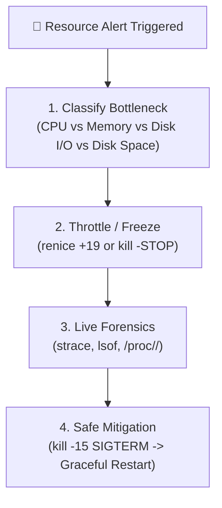

# Runaway Processes & SRE Troubleshooting

## 🧠 The Core Concept & Triage Framework
- **What is a Runaway Process?** A process consuming an abnormal, disproportionate amount of system resources (CPU, RAM, Disk I/O, or Disk Storage), interfering with other system services.
- **Common Root Causes:**
  - **Maladaptive Retry Loops:** Upstream service or DB goes down, and the client application enters a tight `while(true)` retry loop without exponential backoff, pinning CPU cores at 100%.
  - **Memory Leaks:** Allocating heap memory without freeing it, gradually consuming physical RAM until triggering system swapping or the OOM Killer.
  - **Unbounded Logging:** A service logging detailed error stack traces in a tight loop, filling the disk filesystem.
  - **Degenerate / Malicious Code:** Poorly written scripts, crypto-miners, or exploit payloads.
- **The SRE Golden Rule:** **Investigate before terminating!** Never rush to `kill -9`. Killing a process destroys its runtime memory, call stack, and open file descriptors, eliminating all forensic evidence needed to prevent recurrence.



---

## 🛠️ Step-by-Step SRE Troubleshooting Workflow

### 1. Identify the Culprit & Resource Type
- **CPU vs. I/O Check:**
  - Run `uptime` to check 1, 5, and 15-minute load averages against CPU core count (`nproc`).
  - Run `top` or `ps aux --sort=-%cpu`.
  - If `%us` (user) / `%sy` (system) is high and process is in state **`R`** $\rightarrow$ **CPU-Bound Loop**.
  - If `%wa` (iowait) is high and process is in state **`D`** $\rightarrow$ **Storage/Disk I/O Bottleneck**.
- **Memory Consumption:**
  - In `top`, inspect **`RES`** (Resident physical RAM) and press `f` $\rightarrow$ select `DATA` to view process-specific data segments over time.

### 2. Throttle Without Destroying Forensic Evidence
If the runaway process is starving critical production services but you need time to investigate:
```bash
# Option A: Deprioritize to minimum CPU priority
renice -n 19 -p <PID>

# Option B: Pause the process completely (freezes execution instantly)
kill -STOP <PID>

# When ready to resume inspection:
kill -CONT <PID>
```

### 3. Live System Call Forensics (`strace` & `lsof`)
Attach to the running process to see what kernel operations it is performing:
```bash
# Live stream system calls with human-readable string arguments:
strace -p <PID> -s 200

# Profiling summary: attach for 10 seconds, then view error counts and call timing:
strace -c -p <PID>

# Inspect open network connections and locked files:
lsof -p <PID>
```

### 4. Resolving Disk Full Incidents (`df` vs. `du`)
When a runaway process floods the disk:
1. Find the full filesystem: `df -h`
2. Drill down into large directories: `du -sh /* 2>/dev/null | sort -h`
3. **The Unlinked Open File Discrepancy:**
   - If `df -h` shows 100% full, but `du -sh` reports low usage, a process is holding open a deleted file.
   - Locate the culprit:
     ```bash
     lsof +L1                     # List open files with 0 link count (deleted)
     lsof | grep deleted
     ```
   - Truncate live without restarting: `> /proc/<PID>/fd/<FD_NUM>`

---

## 💻 Essential SRE Diagnostic Cheat Sheet

```bash
# 1. Quick Load & Core Ratio Check
uptime && echo "Cores: $(nproc)"

# 2. Top 5 CPU-eating processes
ps aux --sort=-%cpu | head -n 6

# 3. Top 5 Memory-eating processes (by Resident RAM)
ps aux --sort=-%mem | head -n 6

# 4. Trace system calls with timestamps
strace -t -e trace=network,file -p <PID>

# 5. Check if process is hitting resource limits
cat /proc/<PID>/limits | grep -E "Max open files|Max processes"
```

---

## ⚠️ Common Pitfalls & SRE Gotchas

- **Jumping Straight to `kill -9`:** Prevents core dumping, skips heap/stack profiling, and fails to identify the offending query, file, or network peer.
- **Confusing `VIRT` with `RES`:** Alerting on high `VIRT` (Virtual memory) often results in false alarms; always inspect `RES` (Resident physical RAM).
- **Overlooking Disk Wait (`D` State):** Assuming high load average always means high CPU usage. Saturated SAN/NFS storage drives load averages through the roof while CPU usage sits near 0%.
- **Deleting Logs with `rm` Instead of Truncating:** Using `rm` on an active log file unlinks the name but does not free disk blocks until the process releases the file descriptor.

---

## 🔗 Connections (Mental Mapping)
- **Process Architecture & Signals:** [[Process Control]]
- **Privilege Separation:** [[Access Control and Rootly Powers]]
- **Service Management:** [[systemctl]]
- **Kernel Resource Limits:** [[Linux Capabilities]]

---

## ⚡ Active Recall Flashcards

Why is immediately running kill -9 on a runaway process considered bad practice?::It destroys runtime memory, open file descriptors, and stack traces, eliminating all forensic evidence needed for root-cause analysis

How can an SRE immediately stop a runaway process from consuming CPU without killing it?::Send SIGSTOP (kill -STOP <PID>) to pause execution, or use renice -n 19 -p <PID> to lower its priority

What does it indicate if uptime shows a high load average but top reports low CPU utilization and high %wa?::The system is bottlenecked on disk or network storage I/O, with processes stuck in state 'D' (Uninterruptible Sleep)

How do you identify which process is holding open a deleted file that is preventing disk space from freeing?::Use `lsof +L1` or `lsof | grep deleted`

What is the difference between df and du when diagnosing disk space issues?::`df` queries filesystem metadata (including open deleted files); `du` traverses directory trees and calculates size of existing file links
