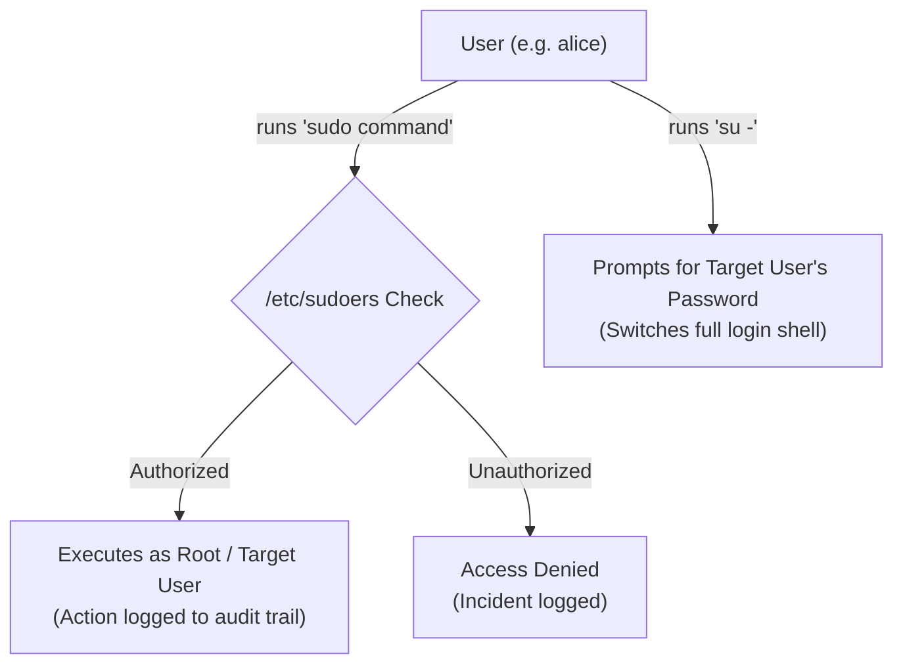

# Access Control and Rootly Powers

## 🧠 The Core Concept
- **The Superuser (`root`):** In UNIX and Linux, user account `root` with **UID `0`** has absolute administrative authority. The kernel bypasses standard permission checks for UID 0, allowing root to access any file, kill any process, and bind to any port.
- **Why avoid logging in as root?** Direct root logins lack an audit trail (you cannot tell *who* ran a destructive command) and make accidental system destruction easy.
- **The Modern Approach (`sudo`):** Users run commands with temporary elevated privileges. `sudo` logs every command to system logs (`/var/log/secure` or `/var/log/auth.log`), requires the user's *own* password (not root's), and restricts actions to specific allowed binaries.



## 🛠️ Key Files & Architecture
- **`/etc/passwd`:** World-readable user database (maps UIDs to usernames, primary GIDs, home dirs, and login shells). Uses an `x` placeholder for passwords.
- **`/etc/shadow`:** Root-only protected file storing salted, encrypted password hashes and aging rules.
- **`/etc/group`:** Defines system and user groups with member lists.
- **`/etc/sudoers`:** Controls which users/groups can execute commands as root or other service accounts.
- **System Accounts:** Service accounts (e.g., `nobody`, `daemon`, `www-data`) with low UIDs (`< 1000`), locked password fields (`!` or `*`), and disabled shells (`/usr/sbin/nologin` or `/bin/false`) to enforce the principle of least privilege.

## 💻 Commands, Syntax & Configuration

### 1. `su` vs. `su -`
```bash
# Switches identity to alice but PRESERVES caller's old environment variables & directory:
su alice

# Full login shell (resets $HOME, $PATH, and executes alice's .bashrc / .profile):
su - alice

# As root (or via sudo), switching user requires NO password:
sudo su - alice
```

### 2. `/etc/sudoers` Syntax & Editing
> [!IMPORTANT]
> **Always** edit the sudoers file using `sudo visudo`. `visudo` locks the file to prevent simultaneous edits and verifies syntax before saving to prevent accidental lockouts.

```text
# User / Command Aliases:
User_Alias ADMINS = alice, bob, charles
User_Alias DB_ADMINS = dave, emily

# Allow group wheel full root access with password:
%wheel ALL=(ALL) ALL

# Allow DB_ADMINS to run any command as user mysql without password:
DB_ADMINS ALL=(mysql) NOPASSWD: ALL

# Allow ADMINS to run logrotate as any user without password:
ADMINS ALL=(ALL) NOPASSWD: /usr/sbin/logrotate
```

## ⚠️ Common Pitfalls & Gotchas
- **Editing `/etc/sudoers` with raw text editors:** A single syntax typo can break `sudo` across the entire machine. Always use `visudo`.
- **Forgetting the dash in `su -`:** Running `su` without `-` keeps the previous user's `$PATH` and environment, leading to subtle path resolution bugs or permission conflicts in scripts.
- **All-or-Nothing Root Compromise:** In the classic model, any compromised root process has total system control. Modern systems mitigate this using [[Linux Capabilities]], [[PAM]], and [[Mandatory Access Control]].

## 🔗 Connections (Mental Mapping)
- **Special Execution Bits:** [[SUID and SGID]]
- **Process Management & Signals:** [[Process Control]]
- **Granular Privileges:** [[Linux Capabilities]]
- **Pluggable Authentication:** [[PAM]]
- **Policy Enforcement:** [[Mandatory Access Control]]
- **Process & Resource Isolation:** [[Linux Namespaces]]

## ⚡ Active Recall Flashcards
Why must `/etc/sudoers` never be edited with a plain editor, and what do you use instead?::One syntax error breaks `sudo` for every user on the box; `sudo visudo` locks the file and validates before saving
<!--SR:!fsrs,2026-09-13T08:39:54.671Z,7,7.31530068,2.11121424,2,2,0,0,2026-09-06T08:39:54.671Z-->

What is the difference between `su user` and `su - user`?::`su -` starts a clean login shell (loading target user's environment & $HOME), while `su` preserves the caller's old environment
<!--SR:!fsrs,2026-09-09T08:15:50.446Z,14,13.82690327,2.11121424,2,2,0,0,2026-08-26T08:15:50.446Z-->

Why is /etc/passwd world-readable while /etc/shadow is root-only?::`/etc/passwd` is needed by utilities (like `ls`) to map UIDs to usernames; `/etc/shadow` holds sensitive password hashes
<!--SR:!fsrs,2026-09-21T08:30:41.318Z,24,23.8839053,1,2,3,0,0,2026-08-28T08:30:41.318Z-->

How to configure a system account to block all interactive shell logins?::Set its shell in `/etc/passwd` to `/usr/sbin/nologin` or `/bin/false`
<!--SR:!fsrs,2026-09-07T08:29:03.049Z,10,9.63662119,6.71744685,2,4,0,0,2026-08-28T08:29:03.049Z-->
