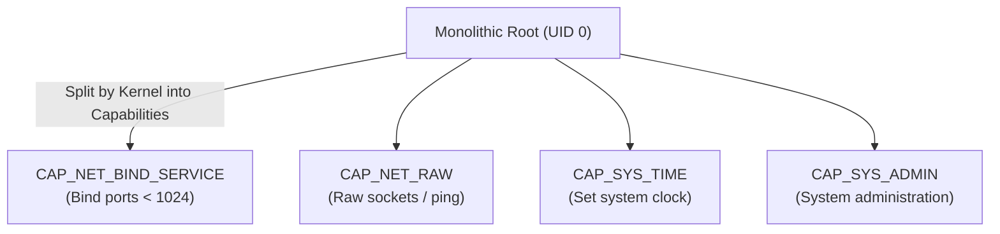

# Linux Capabilities

## 🧠 The Core Concept
- **The Problem:** In traditional UNIX, permissions are binary: a process is either an unprivileged user (UID != 0) or full `root` (UID = 0). If a service only needs to bind to port 80 or adjust the clock, giving it full root (or SUID root) exposes the entire system if the service is compromised.
- **The Solution:** Linux Capabilities divide root's monolithic privileges into **~40 distinct, fine-grained units**. A process or binary can be granted *only* the single capability it requires (Principle of Least Privilege).



## 🛠️ High-Yield Capabilities
| Capability | Permitted Action | Example Use Case |
| :--- | :--- | :--- |
| `CAP_NET_BIND_SERVICE` | Bind to privileged network ports (`< 1024`) | Web servers (`nginx`, `httpd`) running unprivileged |
| `CAP_NET_RAW` | Create RAW and PACKET sockets | Network diagnostics (`ping`, `traceroute`) |
| `CAP_SYS_TIME` | Modify system real-time clock | NTP/Chrony time sync daemons |
| `CAP_DAC_OVERRIDE` | Bypass file read/write/execute permission checks | Backup daemons |
| `CAP_SYS_PTRACE` | Trace/inspect other processes using `ptrace` | Debuggers (`gdb`, `strace`) |

## 💻 Commands & Syntax

### 1. Inspecting File Capabilities
```bash
# View capabilities on a binary:
getcap /usr/bin/ping
# Output: /usr/bin/ping cap_net_raw+ep

# Recursively scan system binaries for capabilities:
getcap -r /usr/bin 2>/dev/null
```

### 2. Setting Capabilities on Host Binaries
```bash
# Grant a web server permission to bind to port 80/443 without root:
sudo setcap 'cap_net_bind_service=+ep' /usr/local/bin/web_server

# Remove all capabilities from a binary:
sudo setcap -r /usr/local/bin/web_server
```
*(Note: `+ep` means Effective and Permitted).*

### 3. Capabilities in Kubernetes & Docker
In containerized environments, the gold standard is **dropping all capabilities** and selectively adding back only the required ones:
```yaml
# Kubernetes Pod SecurityContext (Principle of Least Privilege):
securityContext:
  capabilities:
    drop:
      - ALL
    add:
      - NET_BIND_SERVICE
```

## ⚠️ Common Pitfalls & Gotchas
- **Capabilities on Interpreted Scripts:** Similar to SUID, setting capabilities on interpreted script files (e.g. bash scripts) is not supported by the kernel; capabilities must be applied to compiled binaries.
- **`CAP_SYS_ADMIN` is Almost Root:** `CAP_SYS_ADMIN` is a catch-all capability that grants a wide range of kernel/mount/namespace controls. Giving `CAP_SYS_ADMIN` is often practically equivalent to granting root.

## 🔗 Connections (Mental Mapping)
- **Replaced Mechanism:** [[SUID and SGID]]
- **Parent Hub:** [[Access Control and Rootly Powers]]
- **Container Isolation:** [[Linux Namespaces]]

## ⚡ Active Recall Flashcards
Which Linux capability allows a non-root process to bind to network ports < 1024?::`CAP_NET_BIND_SERVICE`

Audit a host for every binary that carries file capabilities. Command?::`getcap -r / 2>/dev/null` (then `setcap` to change one, e.g. `setcap 'cap_net_bind_service=+ep' <binary>`)

Why are Linux capabilities safer than setting SUID root on a binary?::They grant only a single, specific privilege rather than monolithic, full root power

Which capability allows utility binaries like ping to construct raw network packets?::`CAP_NET_RAW`

Why is granting `CAP_SYS_ADMIN` dangerous?::It is a catch-all capability granting broad system/mount/kernel controls, often equivalent to full root
