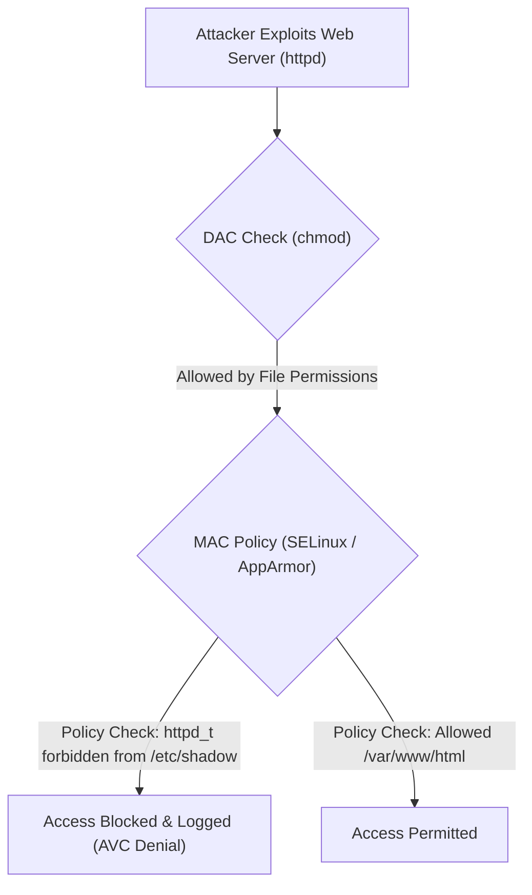

# Mandatory Access Control (MAC)

## 🧠 The Core Concept
- **DAC (Discretionary Access Control):** Traditional Linux model where resource **owners** have discretion over access (`chmod 777`). If a service running as user `httpd` is compromised, an attacker can access/modify everything owned by `httpd` or world-accessible files.
- **MAC (Mandatory Access Control):** A centralized **kernel security policy** enforces access rules over all processes and objects, regardless of user ownership or root privileges. Even if `httpd` runs as `root`, MAC confines it strictly to authorized paths and network ports.



## 🛡️ The Two Primary Linux Implementations

### 1. SELinux (Security-Enhanced Linux)
- **Used by:** RHEL, CentOS, Fedora, Debian (optional), Android.
- **Mechanism:** **Label-based Type Enforcement**. Every file, process, port, and socket is assigned a security context (`user:role:type:sensitivity`).
- **Context Example:** `system_u:object_r:httpd_sys_content_t:s0` (Web server can only access files labeled `httpd_sys_content_t`).
- **Modes:** `Enforcing` (blocks + logs), `Permissive` (logs only, doesn't block), `Disabled`.

### 2. AppArmor
- **Used by:** Ubuntu, Debian, openSUSE, SUSE Linux Enterprise.
- **Mechanism:** **Path-based Profiles**. Restricts programs based on explicit filesystem path rules stored in `/etc/apparmor.d/`.
- **Modes:** `Enforce` (blocks unauthorized access), `Complain` (logs violations without blocking).
- **Advantage:** Simpler to read and maintain than SELinux policies.

## 💻 Essential Commands & Troubleshooting

### SELinux Commands
```bash
# Check current SELinux status:
sestatus

# View file labels:
ls -Z /var/www/html

# Temporarily switch mode (1 = Enforcing, 0 = Permissive):
sudo setenforce 0

# Restore default security contexts on a directory:
sudo restorecon -Rv /var/www/html
```

### AppArmor Commands
```bash
# Check status of AppArmor profiles:
sudo aa-status

# Put a profile into complain/learning mode:
sudo aa-complain /usr/sbin/nginx

# Put a profile into enforce mode:
sudo aa-enforce /usr/sbin/nginx
```

## ⚠️ Common Pitfalls & Gotchas
- **Turning off SELinux/AppArmor instead of fixing contexts:** When web servers throw 403 Forbidden errors despite correct `chmod 755` permissions, the issue is almost always a mislabeled security context (fixable with `restorecon`), not broken software.
- **Moving Files vs Copying Files (`mv` vs `cp` in SELinux):** `mv` preserves the file's original source label (e.g. `user_home_t`), while `cp` creates a new file inheriting the destination directory's context (`httpd_sys_content_t`).

## 🔗 Connections (Mental Mapping)
- **Parent Hub:** [[Access Control and Rootly Powers]]
- **Granular Privileges:** [[Linux Capabilities]]
- **Process Isolation:** [[Linux Namespaces]]

## ⚡ Active Recall Flashcards
What is the core difference between DAC and MAC in Linux?::In DAC, resource owners set permissions; in MAC, a centralized kernel security policy enforces access regardless of ownership or root status

What mechanism does SELinux use to enforce permissions vs AppArmor?::SELinux uses inode security labels/contexts (Type Enforcement); AppArmor uses filesystem path-based profiles

A web server returns 403 on files with correct `chmod` and ownership under SELinux. What is the fix?::`restorecon -Rv <directory>` to reset the security context to the policy default (do not disable SELinux)

Why does moving a file (`mv`) into /var/www sometimes cause web server 403 errors under SELinux?::`mv` preserves the file's original security context rather than inheriting the destination directory's context

What are the three operational modes of SELinux?::`Enforcing` (enforces and logs), `Permissive` (logs violations without blocking), and `Disabled` (turned off)
