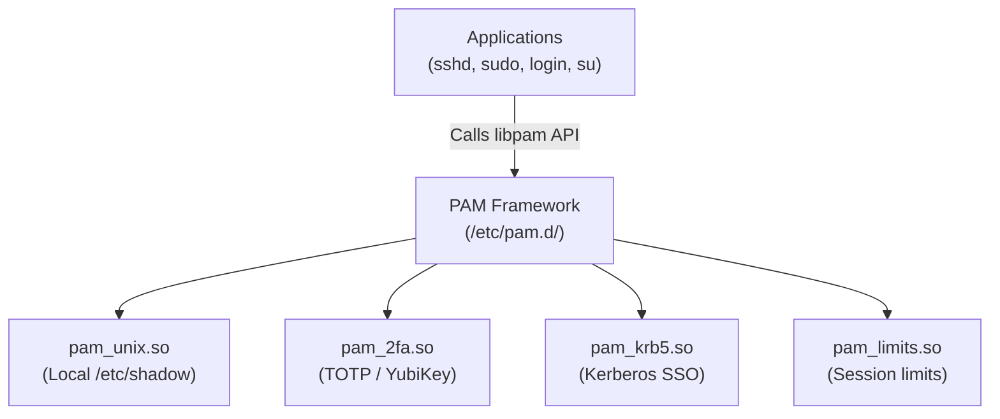

# PAM (Pluggable Authentication Modules)

## 🧠 The Core Concept
- **The Problem:** In early UNIX, every application needing user authentication (`login`, `su`, `sshd`, `ftp`) hardcoded its own password verification logic. Adding support for LDAP, Kerberos, Smart Cards, or 2FA required recompiling every application.
- **The Solution:** PAM provides a **modular, pluggable authentication wrapper**. Applications outsource authentication to PAM. Sysadmins configure authentication policies in `/etc/pam.d/` without modifying or recompiling application binaries.

## 🛠️ The 4 PAM Facilities (High-Level)
Every PAM configuration in `/etc/pam.d/` orchestrates 4 distinct stages:
1. **`auth`:** Verifies user identity (password, TOTP, YubiKey).
2. **`account`:** Validates account status (expiration, time-of-day access).
3. **`password`:** Handles password updates and hashing.
4. **`session`:** Pre/post-login setup (logging, environment, and **resource limits** via `pam_limits.so`).

## 🔍 SRE High-Yield: `pam_limits.so` & Session Limits
The most frequent way PAM affects backend applications and platform engineering is through **`pam_limits.so`**, which reads `/etc/security/limits.conf` during session initialization:
- Sets maximum open file descriptors (`nofile`) — prevents `EMFILE: Too many open files` errors.
- Sets maximum user processes/threads (`nproc`) — prevents thread exhaustion under heavy backend concurrency.
*(Note: For systemd-managed services, limits are configured directly via `LimitNOFILE=` and `LimitNPROC=` inside unit files instead of PAM).*

## ⚠️ Common Pitfalls & Triage
- **PAM Lockouts during Bastion / SSH Hardening:** Misconfiguring `/etc/pam.d/sshd` or `/etc/pam.d/common-auth` can lock all operators out of remote authentication. Always maintain an active secondary SSH session or out-of-band console access when altering PAM policies.

## 🔗 Connections (Mental Mapping)
- **Parent Hub:** [[Access Control and Rootly Powers]]
- **Resource Constraints & Process Control:** [[Process Control]]
- **Service Supervision Limits:** [[systemd]]

## ⚡ Active Recall Flashcards
What problem does PAM (Pluggable Authentication Modules) solve?::Decouples authentication from applications, allowing sysadmins to change auth policies (e.g. 2FA, LDAP) without recompiling programs
<!--SR:!fsrs,2026-09-12T09:28:02.249Z,7,7.4224833,7.84078413,2,4,0,0,2026-09-05T09:28:02.249Z-->

Why is the PAM module `pam_limits.so` relevant to platform engineers?::It applies OS session resource limits (e.g. max open files `nofile` and max processes `nproc`) configured in `/etc/security/limits.conf`
<!--SR:!fsrs,2026-09-07T08:40:05.502Z,1,1.19085722,9.44267659,2,5,1,0,2026-09-06T08:40:05.502Z-->
