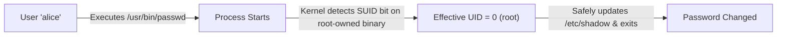

# SUID and SGID

## 🧠 The Core Concept
- **The Problem:** Ordinary users frequently need to perform actions requiring elevated permissions (e.g., updating their password in `/etc/shadow`), but giving them root access is dangerous.
- **The SUID Mechanism (Set User ID):** When a binary with SUID is executed, the process runs with the privileges of the **file's owner** (typically `root`), rather than the user launching it.
- **The SGID Mechanism (Set Group ID):**
  - **On Executables:** The process runs with the privileges of the file's **group**.
  - **On Directories (Team Collaboration):** Any new file or subdirectory created inside inherits the **group ownership** of the directory, rather than the creator's primary group.
- **The Sticky Bit:** On a directory (like `/tmp`), users can create files, but only the file's owner or `root` can delete or rename it.



## 💻 Commands, Syntax & Modes

### 1. Symbolic vs Numeric (4-Digit Octal)
- **SUID:** `4` (Octal) | `chmod u+s <file>`
- **SGID:** `2` (Octal) | `chmod g+s <file_or_dir>`
- **Sticky Bit:** `1` (Octal) | `chmod +t <directory>`

```bash
# Set SUID on an executable binary:
chmod 4755 /usr/local/bin/custom_tool
chmod u+s /usr/local/bin/custom_tool

# Set SGID on a shared team directory:
chmod 2775 /srv/team_project
chmod g+s /srv/team_project

# Set Sticky Bit on a world-writable directory:
chmod 1777 /tmp
chmod +t /tmp
```

### 2. Identifying in `ls -l`
```text
-rwsr-xr-x 1 root root  passwd         # Lowercase 's' = SUID enabled + Execute (x) is ON
-rwSr-xr-x 1 root root  broken_tool    # Capital 'S' = SUID enabled, but Execute (x) is OFF (Broken/Warning!)
drwxrwsr-x 2 root dev   team_project   # Lowercase 's' on group = SGID directory
drwxrwxrwt 5 root root  /tmp           # Lowercase 't' = Sticky bit is active
```

## 🛡️ Container & Platform Relevance (`no_new_privs`)
In modern platform engineering and Kubernetes:
- SUID binaries inside container base images (e.g. `passwd`, `su`, `mount`) are prime attack vectors for **privilege escalation** if an application is compromised.
- Kubernetes security best practice sets `allowPrivilegeEscalation: false` in the pod's `securityContext`. Under the hood, this enables the Linux kernel's `PR_SET_NO_NEW_PRIVS` flag, which completely blocks SUID/SGID bits from elevating privileges during execution.

```yaml
# Kubernetes Pod SecurityContext Best Practice:
securityContext:
  allowPrivilegeEscalation: false
  readOnlyRootFilesystem: true
```

## ⚠️ Common Pitfalls & Security Gotchas
- **SUID on Script Files:** Modern Linux kernels ignore SUID bits on interpreted scripts (e.g., bash, python) due to race conditions and security vulnerabilities. SUID is intended for compiled ELF binaries.
- **SUID on Shells or Editors (GTFOBins):** Placing SUID on editors like `vim` or `nano` allows any unprivileged user to escape to an unrestricted root shell (e.g., via `:!bash` in Vim).

## 🔗 Connections (Mental Mapping)
- **Process Management & Permissions:** [[Process Control]]
- **Granular Modern Replacement:** [[Linux Capabilities]]
- **Container Isolation:** [[Linux Namespaces]]
- **Broader Access Control:** [[Access Control and Rootly Powers]]

## ⚡ Active Recall Flashcards
What does the SUID bit on an executable binary do when a normal user runs it?::The process executes with the privileges of the file's owner (typically root) rather than the caller

Why does Kubernetes recommend setting `allowPrivilegeEscalation: false` in container securityContext?::It sets the kernel `no_new_privs` flag to prevent SUID binaries from elevating privileges inside the container

How does SGID behave when applied to a shared directory?::New files and directories created inside automatically inherit the group ownership of the parent directory

What security protection does the Sticky bit provide on /tmp?::Prevents unprivileged users from deleting or renaming files owned by other users
