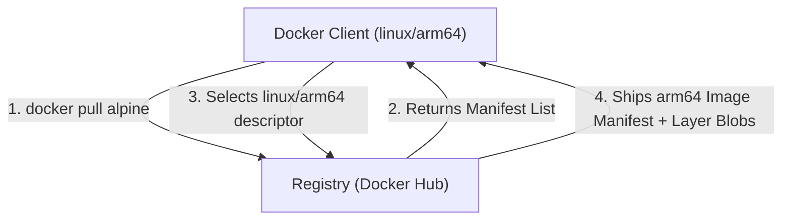

# Container Images and Multi-Arch Manifests

## 🧠 The Core Concept
- **What is a Container Image?** A read-only, build-time blueprint composed of independent, stacked filesystem layers plus a JSON metadata manifest.
- **No Kernel Included:** An image contains only the application binaries, runtime dependencies, and minimal user-space utilities (like Alpine or Debian). Containers share the host Linux kernel directly.
- **Layers are Independent Blobs:** Each layer is a read-only filesystem snapshot identified by a cryptographic hash. Common layers (such as a shared base OS) are cached locally and reused across completely different images to save network bandwidth and disk space.
- **Manifests and Multi-Architecture:** Modern images support multiple CPU architectures (like `amd64` and `arm64`) through a **Manifest List** (also called a "fat manifest" or OCI Image Index). When a client pulls an image, the registry serves the manifest list first. The client checks its own OS and architecture, then retrieves the specific image manifest and layers tailored to its CPU.



---

## 💻 Commands & Inspection

### 1. Pulling and Tag Anatomy
```bash
# Full anatomy: <registry-domain>/<organization-or-user>/<repository>:<tag>
# Default registry is docker.io (Docker Hub); default tag is :latest
docker pull redis:7-alpine

# Pull specifically by cryptographic digest (immutable, tamper-proof):
docker pull redis@sha256:7f14b62f4b4e7232e0bc2612a97cf1bfdbd0a1b65e6d63f03b8606bf40e0be84
```

### 2. Inspecting Manifests and Hashes
```bash
# Inspect the multi-architecture manifest list from a remote registry:
docker manifest inspect redis:7-alpine

# List local images with their Content Digest (SHA-256):
docker images --digests

# Inspect image configuration metadata (CMD, ENTRYPOINT, Env, Architecture):
docker inspect alpine:latest
```

### 3. Cleaning Up Images
```bash
# Remove an image from local storage (fails if any container uses it):
docker rmi alpine:latest

# Remove all dangling images (<none>:<none>):
docker image prune
```

---

## ⚠️ Common Pitfalls (The "Gotchas")

- **Tag Mutability in Production:** Image tags (like `:latest`, `:1.22`, or `:stable`) are movable pointers, not immutable guarantees. If upstream overwrites a tag with a bug fix or new build, different worker nodes pulling that same tag days or hours apart will run different code. **Production fix:** Pin by cryptographic digest (`image@sha256:...`) in Kubernetes manifests or CI/CD pipelines.
- **Distribution Hash vs Content Hash Mismatch:** 
  - When layers travel over the network to or from a registry, Docker compresses them (`.tar.gz`) to save bandwidth. The hash of this compressed file is the **Distribution Hash**.
  - Once extracted onto your host disk, Docker calculates a **Content Hash** of the uncompressed files.
  - *Symptom:* Hashes shown during `docker pull` or in registry API responses do not always match the hashes in local storage outputs because one is compressed and the other is uncompressed.
- **What Actually Causes Dangling Images (`<none>:<none>`):** A dangling image is an image that lost its tag. If you build `myapp:v1`, and later rebuild your project using that exact same tag `myapp:v1`, the tag transfers to the newly built image ID. The previous image's layers remain on disk without a name, showing as `<none>:<none>`. Run `docker image prune` to sweep them away.

---

## 🔗 Connections (Mental Mapping)
- **Runtime Execution:** [[Container Storage and OverlayFS]] (How these read-only layers get mounted and modified at runtime).
- **Process Boundaries:** [[Linux Namespaces]] (How the container process is isolated while running the image binaries).
- **Resource Control:** [[cgroups]] (Restricting CPU and memory consumed by the image workload).

---

## ⚡ Active Recall Flashcards

How does Docker pull the correct binary when you run `docker pull` on an ARM64 machine without specifying an architecture flag?::The registry serves a Manifest List (fat manifest); Docker checks its host architecture and pulls the specific manifest matching its CPU.

Why is deploying with mutable tags (like `:latest` or `:1.24`) an operational risk in production clusters?::Tags can be overwritten upstream, causing different nodes to run different code from the same tag name.

How do you guarantee an immutable, tamper-proof image pull in a production deployment?::Pin the image by its cryptographic digest (`image@sha256:<hash>`) instead of a tag.

Why do layer hashes printed during `docker pull` sometimes differ from hashes shown in local storage?::Docker pulls compressed archives (Distribution Hash), but calculates the Content Hash from uncompressed files on disk.

What creates a dangling (`<none>:<none>`) image on a Docker host?::Rebuilding or pulling an image using a tag that was already assigned to an existing local image, leaving the old image untagged.
