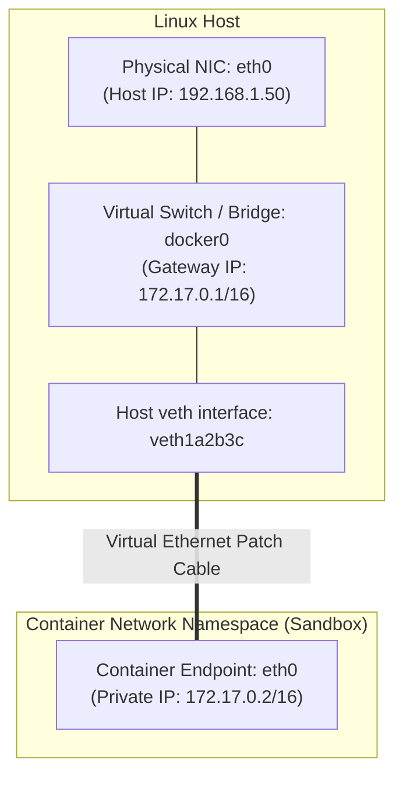

# Container Networking and CNM

## 🧠 The Core Concept

Docker networking is implemented through **`libnetwork`**, the reference implementation of the **Container Network Model (CNM)**.

CNM standardizes container network isolation across three core components:
1. **Sandbox:** The isolated network stack of a container. Inside Linux, this is a dedicated Network Namespace (`CLONE_NEWNET`) containing the container's virtual interfaces, routing tables, and socket state.
2. **Endpoint:** A virtual network interface that plugs a Sandbox into a Network. An endpoint belongs to exactly one Sandbox and one Network.
3. **Network:** A software-defined switch or bridge (like `docker0`) that groups interconnected endpoints together and enforces network boundaries.



---

## 🔌 The 5 Core Network Drivers

Docker provides pluggable network drivers to satisfy different architectural requirements:

| Driver | Scope | Isolation | Operational Use Case |
| :--- | :--- | :--- | :--- |
| **`bridge`** (default) | Single Host | Network Namespace + Virtual Bridge (`docker0`) | Standard isolated application workloads. |
| **`host`** | Single Host | None (shares host network namespace directly) | Maximum network throughput; eliminates NAT and port mapping overhead. |
| **`none`** | Container | Complete (only loopback `lo` interface) | Air-gapped batch jobs or security-isolated token signing. |
| **`overlay`** | Multi-Host | Encapsulated VXLAN tunnel across swarm nodes | Multi-host container clustering (Docker Swarm / Nomad). |
| **`macvlan`** | Single Host | Direct Layer 2 MAC address from host network | Legacy applications requiring routable enterprise LAN IPs. |

---

## 🔄 The Datapath: Egress and Ingress

### 1. Outbound Traffic (Container to Public Internet)
```
Container eth0 (172.17.0.2) 
  --> Host Bridge docker0 (172.17.0.1) 
  --> Kernel Routing Table (net.ipv4.ip_forward = 1) 
  --> Netfilter POSTROUTING Hook (MASQUERADE swaps container IP for host IP) 
  --> Physical NIC eth0 (192.168.1.50) 
  --> Internet
```

### 2. Inbound Traffic (Port Forwarding: `-p 8080:80`)
```
Public Client (Request to 192.168.1.50:8080) 
  --> Netfilter PREROUTING Hook (DOCKER Chain DNAT rewrites destination to 172.17.0.2:80) 
  --> Kernel Routing Table (sees destination is 172.17.0.2) 
  --> Netfilter FORWARD Chain 
  --> Host Bridge docker0 
  --> Container eth0 (172.17.0.2:80)
```

---

## 🔍 Where to Find Docker NAT Rules in the Kernel

Docker manages rules directly in Linux Netfilter. You can inspect these rules using `iptables` or `nftables`.

### 1. Inbound Port Forwarding (DNAT Rules)
To see how `-p 8080:80` is routed to a container, inspect the `DOCKER` chain in the `nat` table:

```bash
sudo iptables -t nat -L DOCKER -n -v
```

*Actual kernel output:*
```text
Chain DOCKER (2 references)
 pkts bytes target     prot opt in     out     source               destination         
    0     0 RETURN     all  --  docker0 *       0.0.0.0/0            0.0.0.0/0           
   12   720 DNAT       tcp  --  !docker0 *       0.0.0.0/0            0.0.0.0/0            tcp dpt:8080 to:172.17.0.2:80
```
- **Interpretation:** Any TCP packet arriving from outside the `docker0` bridge directed to destination port 8080 hits the `DNAT` target and has its destination rewritten to `172.17.0.2:80`.

To view the raw rule syntax:
```bash
sudo iptables -t nat -S DOCKER
```
*Output:*
`-A DOCKER -d 0.0.0.0/0 ! -i docker0 -p tcp -m tcp --dport 8080 -j DNAT --to-destination 172.17.0.2:80`

### 2. Outbound Masquerading (SNAT Rules)
To see how containers egress to the internet, inspect the `POSTROUTING` chain in the `nat` table:

```bash
sudo iptables -t nat -S POSTROUTING
```
*Output:*
`-A POSTROUTING -s 172.17.0.0/16 ! -o docker0 -j MASQUERADE`
- **Interpretation:** Any packet originating from the container subnet `172.17.0.0/16` that leaves through any interface other than `docker0` has its source address masqueraded (replaced with the host external IP).

### 3. Modern nftables View
On modern systems using the `nftables` translation layer:
```bash
sudo nft list table ip nat
```

---

## 💻 Commands & Operational Triage

```bash
# 1. List active Docker network bridges
docker network ls

# 2. Inspect bridge subnet, gateway IP, and all connected containers
docker network inspect bridge

# 3. View host virtual interfaces attached to the docker0 bridge
ip link show master docker0

# 4. View bridge interface forwarding details
bridge link

# 5. Create an isolated custom user-defined bridge network
docker network create --driver bridge app-network

# 6. Run container on a user-defined network (enables automatic DNS resolution)
docker run -d --name api-service --network app-network myapi:latest

# 7. Verify kernel IP forwarding is enabled
sysctl net.ipv4.ip_forward
```

---

## ⚠️ Common Pitfalls (The "Gotchas")

- **The Default Bridge DNS Limitation:** Containers connected to the default `bridge` (`docker0`) cannot resolve each other by container name via DNS; they can only communicate via raw IP addresses or legacy `--link` flags. **Fix:** Create a custom user-defined bridge (`docker network create my-net`). User-defined bridges automatically enable Docker's embedded DNS server (`127.0.0.11`) for seamless container name discovery.
- **The Host Firewall Bypass Vulnerability:** Docker inserts DNAT rules into the `PREROUTING` hook. Because DNAT rewrites the destination to the container bridge IP before routing occurs, incoming traffic skips host `INPUT` firewall chains (such as UFW) and jumps directly to the `FORWARD` chain. To block external traffic to a published Docker container, rules must be placed in the `DOCKER-USER` chain.
- **Kernel IP Forwarding Disabled:** If `sysctl net.ipv4.ip_forward` returns `0`, the Linux kernel drops all packets moving between the physical network interface and `docker0`. Container outbound requests and inbound port publishes will fail completely without generating application logs.

---

## 🔗 Connections (Mental Mapping)

- **Kernel Firewall & NAT:** [[Firewalls and NAT]] (Deep dive into Netfilter hooks, conntrack, and Kubernetes kube-proxy).
- **Container Lifecycle:** [[Docker Container Lifecycle and CLI]] (Using `-p` port mapping and `--network` flags).
- **Network Isolation Primitives:** [[Linux Namespaces]] (How Network Namespaces `CLONE_NEWNET` isolate sockets and interfaces).
- **Host Routing:** [[IP Routing and ARP]] (How the host routing table directs packets to the docker0 gateway).

---

## ⚡ Active Recall Flashcards

Why can containers on a custom user-defined bridge resolve each other by container name while containers on the default docker0 bridge cannot?::User-defined bridges enable Docker's embedded DNS resolver (`127.0.0.11`); the default `docker0` bridge disables automatic container name resolution.

Which iptables table and chain contain Docker's destination NAT (port forwarding) rules?::The `nat` table in the `DOCKER` chain (evaluated via the `PREROUTING` hook).

What is the role of a Linux veth pair in container networking?::It acts as a virtual ethernet cable: one end sits inside the container network namespace as `eth0`, while the peer end attaches to the host `docker0` bridge.

Which command displays the exact iptables rule Docker generated to forward an incoming host port to a container?::`sudo iptables -t nat -S DOCKER` (or `sudo iptables -t nat -L DOCKER -n -v`).

Why does outbound container traffic fail immediately if net.ipv4.ip_forward is set to 0?::The Linux kernel refuses to forward routed packets between the `docker0` bridge and the physical host network interface.
