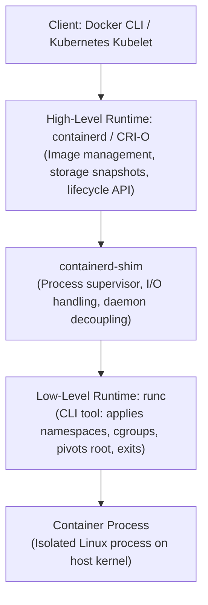

# Container Runtimes (containerd and runc)

## 🧠 The Core Concept

Container management is split into two distinct operational layers: low-level container execution and high-level lifecycle supervision.



### 1. Low-Level Runtime (runc)
- **What it is:** The reference implementation of the Open Container Initiative (OCI) runtime specification.
- **How it works:** `runc` is not a persistent background daemon. It is a short-lived CLI utility. It takes an OCI bundle (a directory containing an unpacked root filesystem and a `config.json` file defining resource limits and isolation parameters), calls Linux kernel primitives (`clone`, `unshare`, `pivot_root`, cgroups), launches the container entrypoint process, and immediately exits.
- **Scope:** Narrow and focused. It knows nothing about pulling images, network bridges, or registries.

### 2. High-Level Runtime (containerd)
- **What it is:** An open-source, CNCF graduated container supervisor originally created by Docker.
- **How it works:** Runs as a persistent host daemon (`containerd.service`). It handles high-level concerns: fetching and unpacking image layers from remote registries, managing local snapshot storage (OverlayFS), setting up container network interfaces via CNI, and invoking `runc` to execute container instances.

### 3. The Decoupling Layer (containerd-shim)
Every running container has an associated lightweight shim process (`containerd-shim`) that sits between `containerd` and the container process:
- **Daemonless Containers:** If the `containerd` daemon crashes or restarts during host maintenance or package upgrades, the container processes keep running uninterrupted. The shim acts as their parent.
- **I/O and File Descriptor Persistence:** The shim holds the standard input, standard output, and standard error streams open via FIFOs/pipes so stdout/stderr logs are preserved across daemon restarts.
- **Exit Status Collection:** When the container process terminates, the shim captures the exit code and waits for `containerd` to read it, preventing zombie processes from accumulating.

---

## 🏗️ Architecture: Docker vs. Kubernetes

### Docker Engine Architecture
```
Docker CLI -> dockerd -> containerd -> containerd-shim -> runc -> Container Process
```
- `dockerd` provides user-facing functionality: the REST API, local volume management, user authentication, Docker Compose, and image builds via BuildKit.
- `dockerd` delegates actual container execution down to `containerd`.

### Kubernetes Architecture (The Dockershim Removal)
```
Kubelet -> CRI gRPC Socket -> containerd (with CRI plugin) -> containerd-shim -> runc -> Pod Containers
```
- Kubernetes communicates with container runtimes using the Container Runtime Interface (CRI), a standardized gRPC API.
- **Why Kubernetes removed dockershim:** In older versions, Kubernetes communicated through a temporary translation layer called `dockershim`, which converted CRI calls to Docker API calls, which called `containerd`, which called `runc`. Removing `dockershim` eliminated the redundant Docker daemon layer, cutting CPU and memory overhead while allowing the Kubelet to communicate directly with `containerd`.

---

## 💻 Commands & Runtime Triage

### 1. Kubernetes Node Inspection (`crictl`)
On modern Kubernetes worker nodes, Docker is absent from the datapath. Use `crictl` to debug node-level container state via the CRI socket:

```bash
# View running pods on the local node
sudo crictl pods

# View container processes running on the local node
sudo crictl ps

# Stream container stdout/stderr logs directly from the node
sudo crictl logs <container-id>

# Execute a shell inside a container for triage
sudo crictl exec -it <container-id> sh
```

### 2. containerd Low-Level Inspection (`ctr`)
`ctr` is containerd's built-in developer CLI. It requires specifying the target namespace to see container workloads:

```bash
# List containers in the Kubernetes namespace
sudo ctr --namespace k8s.io containers list

# List active container tasks (processes) in the Kubernetes namespace
sudo ctr --namespace k8s.io tasks list

# List cached container images in containerd storage
sudo ctr --namespace k8s.io images list
```

### 3. runc State Inspection
```bash
# List containers currently managed by runc on the host
sudo runc list

# Inspect detailed OCI state JSON of a specific container ID
sudo runc state <container-id>
```

---

## ⚠️ Common Pitfalls (The "Gotchas")

- **The "docker ps is empty" Trap on Kubernetes Nodes:** SREs troubleshooting a sick Kubernetes node often run `docker ps` out of muscle memory and see no containers, concluding the node is empty. Modern clusters run `containerd` or `CRI-O` directly. Always use `sudo crictl ps` on cluster nodes.
- **The containerd Namespace Blindspot:** containerd segregates images, containers, and snapshots into distinct namespaces. Docker workloads reside in the `moby` namespace; Kubernetes workloads reside in the `k8s.io` namespace; standard `ctr` commands default to the `default` namespace. Running `ctr images list` without `--namespace k8s.io` displays an empty list on a Kubernetes node.
- **Shim Leaks and Host PID Exhaustion:** If a containerized application crashes abruptly and leaves an open file descriptor or hanging pipe, `containerd-shim` can stay alive even after the workload process exits. Thousands of lingering shims will deplete available host Process IDs (PIDs).
- **Daemon Restarts vs. Shim Isolation:** Restarting `containerd.service` (`sudo systemctl restart containerd`) does not bounce running containers because `containerd-shim` maintains execution. However, killing the shim process (`kill -9 <shim-pid>`) or stopping the host node will terminate the container immediately.

---

## 🔗 Connections (Mental Mapping)

- **Container CLI & Operations:** [[Docker Container Lifecycle and CLI]] (How operators manage these processes).
- **Filesystem Stacking:** [[Container Storage and OverlayFS]] (How containerd prepares the rootfs directory before handing it to runc).
- **Image Distribution:** [[Container Images and Multi-Arch Manifests]] (How containerd pulls and verifies multi-architecture layer blobs).
- **Process Boundaries:** [[Linux Namespaces]] (The kernel primitives that runc configures via `config.json`).
- **Privilege Separation:** [[Linux Capabilities]] (Capabilities runc strips or retains for the container process).

---

## ⚡ Active Recall Flashcards

What is the fundamental operational difference between runc and containerd?::`runc` is a short-lived CLI tool that configures kernel isolation and exits; `containerd` is a persistent daemon supervising the complete container lifecycle.

Why does containerd use a dedicated shim process (containerd-shim) for each running container?::To keep container standard I/O streams and exit status open, allowing containerd to restart without terminating running containers.

Why did Kubernetes deprecate and remove dockershim?::To eliminate the unnecessary Docker daemon translation layer, reducing CPU and memory overhead and simplifying the call path directly to containerd.

Which CLI command should an SRE use to inspect running containers on a Kubernetes worker node using containerd?::`sudo crictl ps` (not `docker ps`, because Docker is not in the runtime call path).

Why does running ctr images list on a Kubernetes worker node show an empty table despite workloads running?::containerd isolates resources by namespace; Kubernetes images reside in the `k8s.io` namespace, requiring the `--namespace k8s.io` flag.
