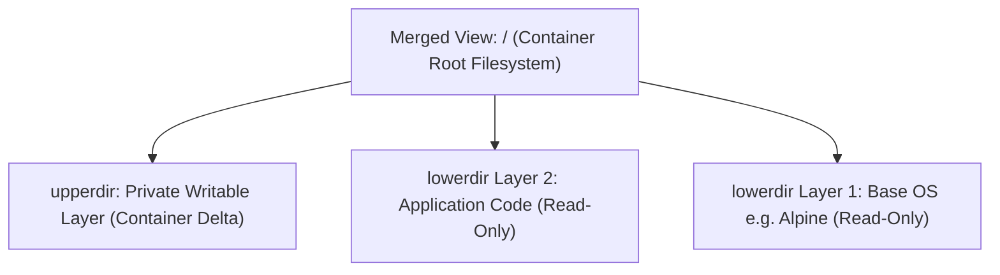

# Container Storage and OverlayFS

## 🧠 The Core Concept
- **What is OverlayFS?** A modern Linux union filesystem driver that merges multiple underlying directories into a single virtual directory tree. It is the default storage driver used by Docker and container runtimes on Linux (`overlay2`).
- **How Image Layers Become a Filesystem:** An image consists of multiple read-only layer directories. OverlayFS stacks these directories and places a single empty, writable directory on top for the container.
- **The Three Directory Roles in OverlayFS:**
  - `lowerdir`: The stacked, read-only directories containing your image layers. Shared across all containers using this image.
  - `upperdir`: The private, read-write directory created specifically for a single running container.
  - `merged`: The unified mount point where the Linux kernel presents the combined view. The container process is rooted into this folder via a Mount Namespace (`pivot_root`).



---

## ⚙️ The Mechanism: Copy-on-Write (CoW)

1. **Reading Files:** When a process reads a file, the kernel checks `upperdir`. If not found, it walks down through `lowerdir` layers until it finds the file and serves it directly.
2. **Writing to Existing Files (The "Copy-Up"):** When a container modifies an existing file from a lower image layer, the kernel intercepts the write, duplicates the file from `lowerdir` into `upperdir`, and writes the changes to that copy. The base image layer remains completely untouched.
3. **Deleting Files (Whiteouts):** If a container deletes a file that originated in a lower read-only layer, OverlayFS cannot delete the lower file. Instead, it writes a special **whiteout character device** in `upperdir` that tells the kernel to hide that file from the merged view.

---

## 💻 Commands & Inspection

### 1. Viewing Container Storage Usage
```bash
# View disk space split between writable layer (size) and total image (virtual size):
docker ps -s
```
*Output sample:*
`CONTAINER ID   IMAGE          SIZE     VIRTUAL SIZE`
`c3f1a2b3c4d5   redis:alpine   2.5kB    32.4MB`

### 2. Inspecting the Host Overlay Mount
```bash
# View active OverlayFS mounts created by Docker on the Linux host:
mount | grep overlay

# Inspect a container's GraphDriver paths (LowerDir, UpperDir, MergedDir):
docker inspect <container-id> --format '{{json .GraphDriver.Data}}' | jq .
```

### 3. Enforcing Read-Only Root Filesystems (SRE Hardening)
```bash
# Prevent any runtime writes to the container's root filesystem:
docker run --read-only --tmpfs /tmp alpine:latest
```

---

## ⚠️ Common Pitfalls (The "Gotchas")

- **Why Docker Cannot Use Hard Links for Edits:** Hard links share the exact same underlying inode and data blocks on disk. If Docker used a hard link when modifying a file, the write would alter the underlying disk blocks directly, mutating the base image layer and corrupting every other container sharing it. Copy-on-Write guarantees isolation by making a separate physical copy in `upperdir`.
- **Image Bloat from Layered Deletions:** If a Dockerfile runs `RUN wget https://example.com/huge.tar.gz` in one step, and `RUN rm huge.tar.gz` in the next step, **the image does not shrink**. The archive remains permanently frozen in the first layer; the second layer merely adds a whiteout marker. **Remedy:** Download, extract, and clean up temporary files in a single chained command (`RUN wget ... && tar -xf ... && rm ...`), or use multi-stage builds.
- **The Storage Multiplier Math:** Running three containers from a 500 MB image consumes approximately **500 MB of host disk space total**, not 1.5 GB. The 500 MB base layers exist once on disk; each container only consumes space for the new files or modified copies stored in its private `upperdir`.

---

## 🔗 Connections (Mental Mapping)
- **Layer Blueprint:** [[Container Images and Multi-Arch Manifests]] (How layers and manifests are packaged, hashed, and pulled).
- **Filesystem Isolation:** [[Linux Namespaces]] (Specifically the Mount Namespace `CLONE_NEWNS` and `pivot_root`).
- **Host Storage Path:** Linux `/var/lib/docker/overlay2/`.

---

## ⚡ Active Recall Flashcards

How does OverlayFS present multiple read-only image layers and a container writable layer as a single filesystem?::It merges the read-only layer directories (`lowerdir`) and the container writable directory (`upperdir`) into a unified mount point (`merged`).

What happens under the hood when a container modifies a file that resides in a read-only base image layer?::OverlayFS performs a "copy-up": it copies the file from the lower layer into the container's private `upperdir` before writing the changes.

Why does running `rm <file>` in a later Dockerfile layer fail to reduce the final image size?::The file remains frozen in the earlier read-only layer; the later layer only adds a whiteout marker that hides it from view.

How much host disk space is consumed by running five containers from a single 300 MB image if none write new files?::Approximately 300 MB total, because all five containers share the exact same read-only lower directories on disk.

Why can't container storage drivers use hard links to handle file modifications between layers?::Hard links share the same inode and disk blocks; modifying a hard link would mutate the base layer and corrupt all other containers sharing it.
