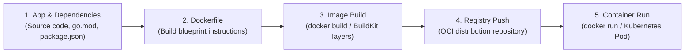

# Containerizing Applications

## 🧠 The Core Concept

Containerizing an application packages application source code, runtime dependencies, system libraries, and runtime configuration into an immutable, portable OCI container image.

The standard containerization lifecycle follows five distinct phases:



---

## 🏗️ Anatomy of a Production Dockerfile

A Dockerfile contains a sequence of declarative instructions executed from top to bottom by the image builder (BuildKit):

```dockerfile
# 1. Base image declaration (pinned to immutable or specific version)
FROM golang:1.24-alpine AS builder

# 2. Set isolated working directory
WORKDIR /app

# 3. Cache dependencies: copy lockfiles first before application source
COPY go.mod go.sum ./
RUN go mod download

# 4. Copy source files and compile static binary
COPY . .
RUN CGO_ENABLED=0 GOOS=linux go build -ldflags="-w -s" -o /app/server .

# -------------------------------------------------------------
# Production Runtime Stage (Multi-Stage Build)
# -------------------------------------------------------------
FROM alpine:3.21

# 5. Create unprivileged service user and group
RUN addgroup -S appgroup && adduser -S appuser -G appgroup

WORKDIR /home/appuser

# 6. Copy only the compiled binary from the builder stage
COPY --from=builder /app/server ./server

# 7. Drop root privileges
USER appuser

# 8. Document listening port and define immutable entrypoint
EXPOSE 8080
ENTRYPOINT ["./server"]
```

---

## ⚡ Build Optimization & Layer Caching

BuildKit builds images layer by layer. Each instruction creates a read-only filesystem layer cached by a content hash.

### 1. The Cache Invalidation Cascade
- If a layer's contents change, BuildKit invalidates that layer's cache and executes all subsequent steps from scratch without using the cache.
- **The Golden Rule of Ordering:** Order Dockerfile instructions from least frequently changed to most frequently changed:
  1. Base OS configuration and system packages (`RUN apk add ...`)
  2. Language dependencies and lockfiles (`COPY go.mod` / `RUN go mod download`)
  3. Application source code (`COPY . .`)
  4. Build command (`RUN go build`)

### 2. Build Context and `.dockerignore`
When `docker build .` executes, the Docker CLI sends the entire current directory (the "build context") as a tar archive to the Docker daemon or BuildKit worker.
- Without a `.dockerignore` file, gigabytes of local vendor folders, Git histories (`.git`), temporary test databases, and local secrets are transmitted over the daemon socket, slowing builds and risking secret leakage.
- **Essential `.dockerignore` contents:**
  ```text
  .git
  .github
  node_modules
  bin/
  dist/
  *.env
  *.log
  ```

### 3. Multi-Stage Builds
Multi-stage builds use multiple `FROM` instructions in a single Dockerfile.
- **The Problem:** Compiling code requires compilers (Go, GCC, Rust), header files, and build tools, resulting in multi-gigabyte images full of unnecessary binaries.
- **The Solution:** Compile inside a heavy build stage (`AS builder`), then copy only the compiled binary into a minimal runtime image (Alpine or `scratch`).
- **Benefits:** Slashes image size from 1.5 GB down to 20 MB, removes package managers from production, and drastically cuts the Common Vulnerabilities and Exposures (CVE) attack surface.

---

## 💻 Essential Commands

```bash
# 1. Build an image with a tag using the current directory context
docker build -t myapp:1.0.0 .

# 2. Build using explicit build context path and custom Dockerfile name
docker build -f Dockerfile.prod -t myapp:prod ./src

# 3. Push built image to remote registry
docker push myregistry.io/team/myapp:1.0.0

# 4. Inspect image layer build history and cache hit status
docker history myapp:1.0.0

# 5. Reclaim disk space by cleaning unused BuildKit build cache
docker builder prune -f
```

---

## ⚠️ Common Pitfalls (The "Gotchas")

- **The Premature `COPY . .` Anti-Pattern:** Placing `COPY . .` before installing dependencies invalidates the dependency cache on every single line of code edited. This forces the builder to redownload all external packages on every build. Always copy lockfiles first, run download commands, and copy source code last.
- **Defaulting to Host Root (UID 0):** By default, container processes run as `root` (UID 0). While isolated by kernel namespaces, running as root increases the danger of host privilege escalation in container escape vulnerabilities. Always create and switch to a non-root user via `USER <name-or-id>`.
- **Leaking Secrets via `ARG` or `ENV`:** Values passed via `ARG` or `ENV` are permanently visible in image layer metadata through `docker inspect` or `docker history`. Use BuildKit secret mounts (`RUN --mount=type=secret,id=mysecret ...`) for private keys and tokens needed during builds.
- **Dangling Build Cache Accumulation:** BuildKit caches intermediate layers aggressively. In high-frequency developer environments or CI/CD runners, `/var/lib/docker/buildkit/` can silently consume tens of gigabytes of disk space until pruned with `docker builder prune`.

---

## 🔗 Connections (Mental Mapping)

- **Runtime Execution:** [[Docker Container Lifecycle and CLI]] (How images built from Dockerfiles are executed and supervised).
- **Layer Stacking:** [[Container Storage and OverlayFS]] (How Dockerfile instructions translate to read-only OverlayFS lowerdir layers).
- **Distribution:** [[Container Images and Multi-Arch Manifests]] (How images are tagged, hashed, and served across CPU architectures).
- **Execution Architecture:** [[Container Runtimes (containerd and runc)]] (How the OCI runtime bundle is prepared from image layers).

---

## ⚡ Active Recall Flashcards

Why should dependency lockfiles (such as go.mod or package.json) be copied into a Dockerfile before the application source code?::To prevent application source code changes from invalidating the cached dependency layer, avoiding unnecessary dependency re-downloads.

What is the primary architectural benefit of multi-stage Docker builds?::They isolate build tools and compilers in early stages and copy only the compiled binary into the final minimal image, shrinking size and attack surface.

What purpose does a .dockerignore file serve during the image build process?::It prevents large or sensitive local files (like .git, vendor directories, or secret files) from being packaged into the build context sent to the Docker daemon.

Why is running container processes as the default root user (UID 0) discouraged in production?::If a container escape vulnerability occurs, a process running as root has a significantly higher chance of obtaining full root control over the host kernel.

Which CLI command reclaims host disk space consumed by unused intermediate BuildKit image layers?::`docker builder prune`
