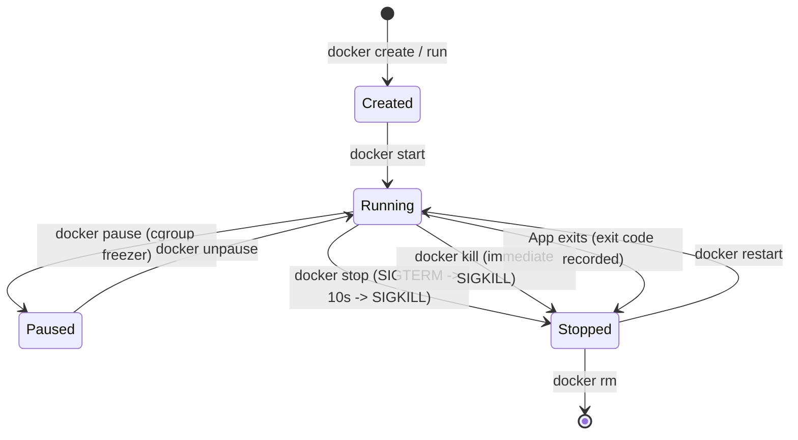

# Docker Container Lifecycle and CLI

## 🧠 The Core Concept

A container is not a virtual machine. It is an ordinary Linux process running directly on the host kernel, isolated by Linux Namespaces, constrained by Control Groups (cgroups), and rooted into an OverlayFS filesystem.

The Docker CLI manages the state machine governing these processes from creation to destruction:



### Host Privileges and the Docker Socket
Running Docker commands without `sudo` requires adding the user to the local `docker` group:
```bash
sudo usermod -aG docker $USER
```
- **Security Reality:** The Docker daemon socket (`/var/run/docker.sock`) is owned by `root:docker`. Granting write access to this socket is equivalent to granting unlogged root privileges on the host. Any member of the `docker` group can execute a container that binds the host root filesystem (`docker run -v /:/host -it alpine chroot /host`) to gain root access over the host machine.

---

## 💻 Essential Commands & Operational Triage

### 1. Launching Containers
```bash
# Run a background (detached) container with host port binding and friendly name
docker run -d --name web-proxy -p 8080:80 nginx:alpine

# Run an ephemeral interactive shell (auto-deletes filesystem upon exit)
docker run -it --rm ubuntu:24.04 bash

# Run with an automatic restart policy (restarts unless manually stopped)
docker run -d --name redis-cache --restart unless-stopped redis:alpine

# Run with init process enabled (tini) to reap zombies and forward signals
docker run -d --name worker-app --init myapp:latest
```

### 2. Inspecting and Diagnosing Live Containers
```bash
# List active containers
docker ps

# List all containers (including stopped, crashed, and exited)
docker ps -a

# Stream standard output and standard error logs with timestamps
docker logs -f --tail 100 web-proxy

# Execute a diagnostic shell inside an already running container
docker exec -it web-proxy sh

# Stream real-time cgroup CPU, memory, network, and block I/O utilization
docker stats

# Inspect container low-level JSON configuration, IP address, and mounts
docker inspect web-proxy --format '{{range .NetworkSettings.Networks}}{{.IPAddress}}{{end}}'
```

### 3. Stopping and Cleaning Up
```bash
# Graceful stop: sends SIGTERM, waits 10 seconds, then sends SIGKILL
docker stop web-proxy

# Immediate stop: sends SIGKILL immediately
docker kill web-proxy

# Remove an exited container (frees its writable upperdir layer)
docker rm web-proxy

# Force-remove a running container immediately
docker rm -f web-proxy

# Clean up all stopped containers, unused networks, and dangling images
docker system prune
```

---

## ⚠️ Common Pitfalls (The "Gotchas")

- **The PID 1 Signal Trap:** Inside a container PID namespace, the entrypoint process runs as Process ID 1 (PID 1). In Linux, PID 1 does not install default signal handlers. If the containerized application (such as Node.js, Python, or a Go binary) does not explicitly catch `SIGTERM`, `docker stop` hangs for exactly 10 seconds before Docker falls back to `SIGKILL`. This prevents orderly socket draining and database connection teardown. **Fix:** Handle `SIGTERM` in code, or run the container with the `--init` flag to inject a lightweight init system (`tini`).
- **Zombie Process Accumulation:** If an application process spawns subprocesses that terminate, and the parent fails to invoke `wait()` or `waitpid()`, the terminated children become zombie processes (`<defunct>`). Normally, the host `init` process adopts and reaps orphans. Inside a container without an init process, zombies remain in the container process table until host PID space is exhausted. **Fix:** Use `--init`.
- **Storage Leaks from Abandoned Containers:** Stopping a container with `docker stop` leaves its writable layer (`upperdir`) and log files on the host disk in `/var/lib/docker/`. Repeatedly executing automated tasks or scripts without `--rm` causes stopped containers to accumulate until host disk space or inodes are completely exhausted.
- **Port Allocation Collisions:** If `docker run -p 8080:80` fails with `bind: address already in use`, another process or container is already bound to port 8080 on the host interface. Run `ss -tulpn | grep 8080` on the host to identify the conflicting process.

---

## 🔗 Connections (Mental Mapping)

- **Execution Engine:** [[Container Runtimes (containerd and runc)]] (How dockerd passes execution to containerd and runc).
- **Filesystem Layers:** [[Container Storage and OverlayFS]] (How the container writable layer is created and discarded).
- **Image Blueprints:** [[Container Images and Multi-Arch Manifests]] (How images are tagged, pulled, and verified).
- **Kernel Isolation:** [[Linux Namespaces]] (How UTS, PID, NET, and MNT isolate container processes).
- **Signal Handling:** [[Process Control]] (How Linux processes respond to SIGTERM, SIGKILL, and SIGSTOP).

---

## ⚡ Active Recall Flashcards

What signal sequence does docker stop send to a running container?::It sends `SIGTERM`, waits a default 10-second grace period for cleanup, and then sends `SIGKILL`.

Why does docker stop often hang for 10 seconds on poorly configured container applications?::The application runs as Process ID 1 (PID 1) without an explicit `SIGTERM` signal handler, ignoring the termination request until Docker forces `SIGKILL`.

How does running a container with the --init flag prevent zombie process accumulation?::It inserts a lightweight init system (`tini`) as Process ID 1 to forward signals and reap orphaned child processes.

Why is adding an unprivileged user to the host docker group considered a severe security risk?::Access to `/var/run/docker.sock` allows mounting the host root filesystem into a container, granting full root privileges over the host.

Which flag ensures a temporary debugging container automatically deletes its writable storage layer upon exit?::`--rm` (`docker run --rm ...`)
