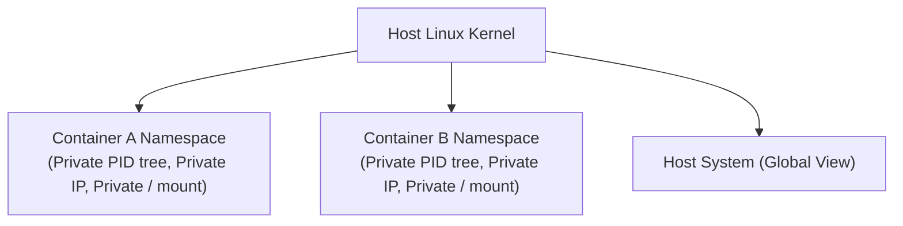

# Linux Namespaces

## 🧠 The Core Concept
- **What is it?** A Linux kernel feature that partitions global system resources into **isolated virtual views** for processes.
- **Why does it matter?** Namespaces are the foundational kernel technology that powers **Docker, Podman, and containerization**. While [[Linux Capabilities]] restrict *what a process can do*, Namespaces restrict *what a process can see*.
- **Complementary Feature (cgroups):** Namespaces provide *isolation* (what you see), while Control Groups (`cgroups`) provide *resource metering* (how much CPU/RAM/IO you can use).



## 🛠️ The 7 Core Linux Namespaces
| Namespace | Flag | Isolated System Resource |
| :--- | :--- | :--- |
| **PID** | `CLONE_NEWPID` | Process IDs (process inside sees itself as PID 1) |
| **NET** | `CLONE_NEWNET` | Network devices, IP addresses, routing tables, port bindings |
| **MNT** | `CLONE_NEWNS` | Filesystem mount points |
| **UTS** | `CLONE_NEWUTS` | Hostname and NIS domain name |
| **IPC** | `CLONE_NEWIPC` | Inter-process communication (System V IPC, POSIX message queues) |
| **USER** | `CLONE_NEWUSER` | User & Group IDs (maps UID 0 in container to unprivileged UID on host) |
| **CGROUP**| `CLONE_NEWCGROUP`| Virtualized view of cgroup hierarchy |

## 💻 Commands & Inspection

### 1. Inspecting Process Namespaces
```bash
# View all active namespaces:
lsns

# View namespaces belonging to a specific PID:
ls -l /proc/<PID>/ns/
```

### 2. Spawning Processes in Isolated Namespaces
```bash
# Launch a new bash shell with an isolated hostname (UTS) and isolated PID tree:
sudo unshare --uts --pid --fork bash

# Inside the new shell:
hostname isolated-box
hostname   # Prints isolated-box (Host system hostname remains unchanged!)
```

### 3. Entering an Existing Namespace
```bash
# Join an existing container or process namespace:
nsenter --target <PID> --net --pid
```

## ⚠️ Common Pitfalls & Gotchas
- **USER Namespaces and Root Inside Containers:** Without user namespaces (`CLONE_NEWUSER`), a root user (`UID 0`) inside a container is the identical `UID 0` on the host kernel. If the container escapes isolation, it has host root privileges.
- **Confusing Namespaces with Virtual Machines:** Namespaces share the single host Linux kernel (zero hypervisor overhead). They provide process isolation, not hardware virtualization.

## 🔗 Connections (Mental Mapping)
- **Security Confinement:** [[Mandatory Access Control]]
- **Fine-Grained Powers:** [[Linux Capabilities]]
- **Parent Hub:** [[Access Control and Rootly Powers]]

## ⚡ Active Recall Flashcards
What two Linux kernel technologies combine to create containers (like Docker)?::Namespaces (resource isolation / what you see) and cgroups (resource limits / how much you use)
<!--SR:!fsrs,2026-09-10T09:44:08.953Z,5,5.34957185,8.88648233,2,5,0,0,2026-09-05T09:44:08.953Z-->

Which Linux namespace allows a process inside a container to view itself as PID 1?::PID Namespace (`CLONE_NEWPID`)
<!--SR:!fsrs,2026-09-07T09:44:02.154Z,2,1.63123901,9.54981835,2,6,0,0,2026-09-05T09:44:02.154Z-->

How do you see which namespaces a given process lives in?::`ls -l /proc/<PID>/ns/` (or `lsns -p <PID>`)

How do User Namespaces (`CLONE_NEWUSER`) enhance container security?::They map UID 0 (root) inside the container to a non-privileged UID on the host machine
<!--SR:!fsrs,2026-09-09T09:14:39.362Z,3,2.77568992,9.42386215,2,5,0,0,2026-09-06T09:14:39.362Z-->

A container image has no shell or network tools. How do you debug its networking from the host?::`nsenter --target <container PID> --net` then run the host's `ss` / `ip` inside that namespace
<!--SR:!fsrs,2026-09-06T09:16:11.136Z,0,0.212,6.4133,1,1,0,0,2026-09-06T09:15:11.136Z-->
