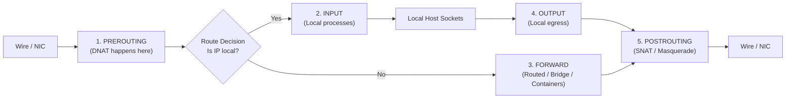

# Firewalls, Netfilter, and NAT

## 🧠 The Core Concept

Linux firewalls do not inspect packets in user space. All packet filtering, translation, and mangling happen inside the Linux kernel via the **Netfilter** subsystem. User-space utilities like `nftables` and `iptables` do not process traffic themselves; they compile rules and inject them into Netfilter.



### 1. The 5 Netfilter Kernel Hooks
Every packet traversing a Linux network stack hits Netfilter hooks in a strict sequence:
1. **Prerouting:** Evaluated as soon as a packet arrives from the physical wire, before the kernel consults the routing table. Destination NAT (DNAT) occurs here.
2. **Input:** Evaluated for packets addressed to a local socket or process running on this machine. Host security policies evaluate here.
3. **Forward:** Evaluated for packets addressed to another IP or interface (for example, traffic routed between subnets or directed to containers on a bridge).
4. **Output:** Evaluated for packets generated by local processes on this machine.
5. **Postrouting:** Evaluated right before a packet leaves via a physical or virtual interface. Source NAT (SNAT and Masquerade) occurs here.

### 2. Modern nftables vs. Legacy iptables
- **iptables (Legacy):** Rigid built-in tables (`filter`, `nat`, `mangle`) and fixed chains. IPv4, IPv6, ARP, and bridge traffic required separate binaries (`iptables`, `ip6tables`, `arptables`, `ebtables`). Rules are evaluated sequentially in the kernel.
- **nftables (Modern):** Completely modular. No default tables or chains exist until created. Combines IPv4 and IPv6 under one unified family (`inet`). Executes rules using an in-kernel bytecode virtual machine, offering higher performance and atomic ruleset updates.

---

## 🔄 NAT (Network Address Translation) Mechanics

NAT rewrites packet headers in transit so private RFC 1918 IP addresses (such as container networks or private LANs) can communicate across public networks.

### The Office Mailroom Mental Model
- A container has an internal desk extension (private IP `172.17.0.2`).
- External internet routers drop private IP addresses because they cannot route return traffic back to an internal desk.
- The Linux kernel acts as the company mailroom clerk: it erases the desk extension on outbound packets, writes the building's public street address (the host IP) on the envelope, and records the conversation in a state table (`conntrack`). When replies arrive, it rewrites the envelope back to the desk extension.

### The Two Flavors of NAT
1. **SNAT and MASQUERADE (Source NAT: Outbound Traffic):**
   - **Hook Location:** Evaluated at the **Postrouting** hook.
   - **Mechanism:** Rewrites the sender's private source IP (`172.17.0.2`) to the host public IP.
   - **Masquerade:** A dynamic variant of SNAT designed for interfaces where the host IP may change (such as DHCP). It automatically queries the outbound interface for its current IP address.
2. **DNAT (Destination NAT: Inbound Port Forwarding):**
   - **Hook Location:** Evaluated at the **Prerouting** hook.
   - **Mechanism:** Rewrites the destination IP and port from the host public address (`host-ip:8080`) to the container private IP (`172.17.0.2:80`).
   - **Why Prerouting:** The kernel must rewrite the destination IP before consulting the routing table. If DNAT ran later, the kernel would treat the packet as local host traffic and attempt to deliver it to a non-existent local socket.

---

## ☸️ Container & Kubernetes Datapath Realities

### 1. Docker Bridge Routing and Kernel Forwarding
Containers connect to a virtual bridge interface (`docker0`). To allow traffic to cross between `docker0` and the host physical network card (`eth0`), Linux kernel IPv4 forwarding must be enabled:
```bash
# Check status (must return 1)
sysctl net.ipv4.ip_forward

# Enable dynamically
sudo sysctl -w net.ipv4.ip_forward=1
```
If this value is `0`, the kernel discards all routed container packets immediately.

### 2. The Docker Host Firewall Bypass Trap
Docker writes raw Netfilter rules directly to implement container port publishing (`-p 8080:80`).
- When an administrator configures a host firewall (like UFW or custom `INPUT` chain rules) to block port 8080, the administrator expects the port to be closed.
- However, Docker installs DNAT rules in the **Prerouting** hook. The destination IP is rewritten to the container bridge IP before reaching the routing decision. The packet is then routed to the **Forward** chain, completely bypassing the host **Input** chain.
- **Result:** External clients can connect directly to container services even when host firewall tools show the port as blocked.

### 3. Kubernetes kube-proxy Datapath Evolution
In Kubernetes, `kube-proxy` maps Service virtual IPs (ClusterIP) to backend Pod IPs:
- **iptables Mode:** Creates sequential chains with probability matching for load balancing. In large clusters (thousands of Services), iptables incurs linear rule evaluation overhead ($O(N)$), causing packet processing latency and lock contention during updates.
- **IPVS Mode:** Uses Linux IPVS kernel hash tables ($O(1)$ lookups) to support high-throughput clusters without linear latency degradation.
- **nftables Mode:** Modern Kubernetes backend designed to eliminate legacy iptables global table locks.
- **eBPF (Cilium, Calico):** Modern container platforms increasingly replace `kube-proxy` entirely by attaching eBPF programs directly to network sockets and interfaces, bypassing Netfilter tables entirely for near-bare-metal performance.

---

## 💻 Commands & Operational Triage

```bash
# 1. View the complete active nftables ruleset
sudo nft list ruleset

# 2. Stream live firewall events and rule updates in real time
sudo nft monitor

# 3. Atomically load or reload ruleset from a file
sudo nft -f /etc/nftables.conf

# 4. Verify whether IPv4 forwarding is active
sysctl net.ipv4.ip_forward

# 5. Inspect conntrack state table entries and check table size
sudo conntrack -L

# 6. Check maximum and current connection tracking capacity
sysctl net.netfilter.nf_conntrack_count net.netfilter.nf_conntrack_max

# 7. Check whether system iptables command targets legacy or nft backend
update-alternatives --display iptables
```

---

## ⚠️ Common Pitfalls (The "Gotchas")

- **The Docker Port Bypass Security Leak:** Relying on host-level firewall scripts in the `INPUT` chain to restrict container ports fails silently. To restrict Docker container access, rules must be placed in Docker's custom `DOCKER-USER` chain on the `FORWARD` hook.
- **Conntrack Table Exhaustion:** High-throughput microservices or DDoS events can fill the kernel connection tracking table. When `nf_conntrack_count` reaches `nf_conntrack_max`, the kernel prints `nf_conntrack: table full, dropping packet` in `dmesg` and drops all new TCP handshakes.
- **The iptables-legacy vs. iptables-nft Divergence:** If legacy container tools write rules via `iptables-legacy` while host automation manages `nftables`, both rule engines run concurrently in the kernel. Packets accepted by one engine can be silently dropped by the other.
- **Ephemeral IP Forwarding:** Running `sysctl -w net.ipv4.ip_forward=1` resets upon system reboot. Persistent configuration requires writing `net.ipv4.ip_forward = 1` into `/etc/sysctl.d/99-kubernetes.conf` or `/etc/sysctl.conf`.

---

## 🔗 Connections (Mental Mapping)

- **Foundation:** [[Linux Networking Fundamentals]] (Layer 3 routing and Layer 4 ports).
- **Packet Traversal:** [[IP Routing and ARP]] (How the routing table handles forwarded vs local traffic).
- **Triage Ladder:** [[Network Troubleshooting]] (Using `nc` and `tcpdump` to verify firewall behavior).
- **Container Bridge:** [[Container Runtimes (containerd and runc)]] (How container networks attach to host bridges).
- **Container Operations:** [[Docker Container Lifecycle and CLI]] (How `docker run -p` provisions NAT rules).

---

## ⚡ Active Recall Flashcards

Why must Destination NAT (DNAT) for container port forwarding occur at the Prerouting hook instead of Input?::The destination IP must be rewritten to the container private IP before the routing decision, otherwise the packet is treated as local host traffic.

What happens to outbound container traffic if net.ipv4.ip_forward is set to 0?::The Linux kernel refuses to forward packets between the container bridge and physical network interfaces, dropping outbound traffic.

Why does a container need Source NAT (SNAT or Masquerade) to access the public internet?::Containers have private RFC 1918 IPs that external routers cannot route back to; the host must swap the container IP with its own routable IP.

Why can Docker containers remain publicly accessible even when an administrator adds host firewall rules to block the port?::Docker injects DNAT rules at Prerouting that redirect packets into the Forward chain before host Input filter rules are evaluated.

Why did large Kubernetes clusters migrate away from iptables-based kube-proxy?::iptables evaluates rules sequentially ($O(N)$), causing high latency, CPU load, and table lock contention across thousands of Services.
