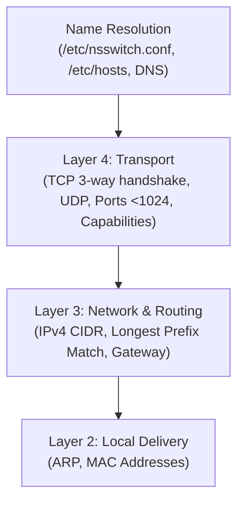

# Linux Networking Fundamentals

## 🧠 The Core Concept
Linux networking operates on layered abstractions that separate local physical delivery (Layer 2) from global routing (Layer 3), application endpoints (Layer 4), and name resolution:

---

## 📂 Modular Subject Notes

This topic is organized into four focused atomic notes:

1. **[[IP Addressing and Subnetting]]:** 32-bit IPv4 structure, CIDR prefix masks, usable host formulas ($2^{32-\text{prefix}} - 2$), and subnet block boundaries beyond `/24`.
2. **[[IP Routing and ARP]]:** Local delivery via Layer 2 ARP broadcasts, remote delivery via Default Gateway, routing tables (`ip route`), Longest Prefix Match (LPM), and RTNETLINK destination syntax rules.
3. **[[Transport Protocols and Ports]]:** TCP connection lifecycle (handshake, sequence tracking, teardown) vs UDP, port allocation (1 to 65,535), privileged ports (< 1024), and binding via `CAP_NET_BIND_SERVICE`.
4. **[[Linux Name Resolution Architecture]]:** The three-file glibc resolution pipeline (`/etc/nsswitch.conf`, `/etc/hosts`, `/etc/resolv.conf`) and dynamic resolver interactions.

---

## 🔗 Related & Advanced Topics

- **Diagnostics & Triage:** [[Network Troubleshooting]] (diagnostic ladder: `ping`, `mtr`, `nc`, `ss`, `dig`, `tcpdump`)
- **Firewalls & Kernel Datapath:** [[firewalls and nat]] (Netfilter hooks, NAT mechanics, container bridge networking)
- **Web Servers:** [[httpd]]
- **System Supervision:** [[systemd]], [[systemd units]]
