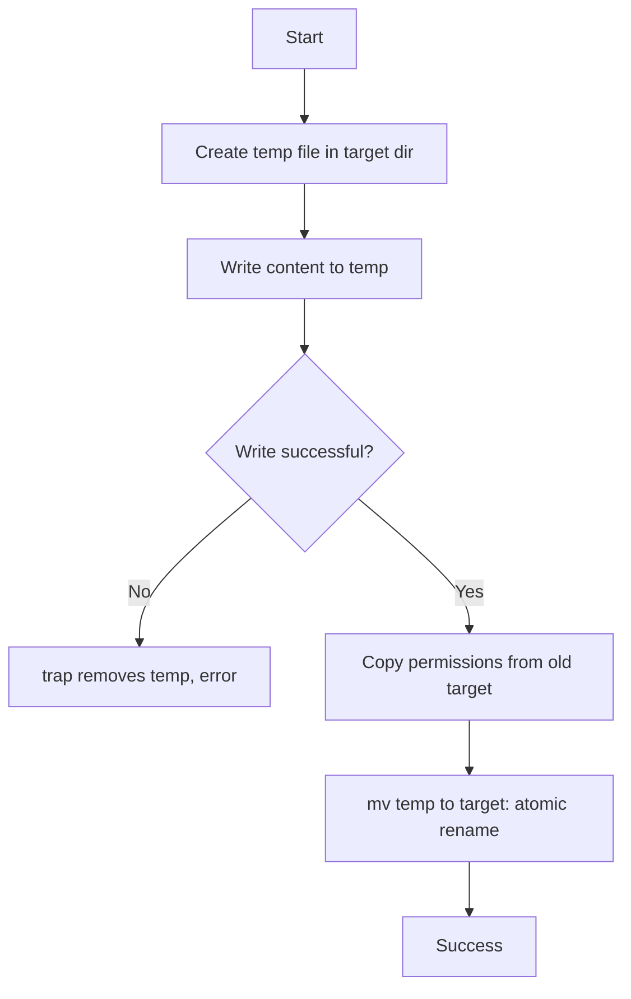

# Bash File Operations

Drill skill: `files-logs` in [[Drills - Bash]]. Hub: [[Bash]].

## 🧠 The Core Concept

Every file operation in a script follows the same shape: **test first, act on a quoted path, write atomically, clean up with `trap`**. The five rules:

1. **Validate:** check existence and permissions before acting (`-f`, `-d`, `-r`, `-w`).
2. **Quote:** every path expansion is `"$path"`, never `$path`.
3. **Temp then move:** write to a `mktemp` file in the target's directory, then `mv` it into place.
4. **Handle errors:** check return codes and print a message to stderr.
5. **Clean up:** `trap ... EXIT` removes temp files and lock dirs on every exit path.



---

## 💻 Syntax & Reference

### 1. File Test Operators

| Test | True when | Typical use |
| :--- | :--- | :--- |
| `-e "$p"` | path exists (any type) | generic guard |
| `-f "$p"` | regular file | before reading or copying |
| `-d "$p"` | directory | before `cd`, globbing, `rm -rf` |
| `-L "$p"` | symbolic link | avoid following links on delete |
| `-r` / `-w` / `-x "$p"` | readable / writable / executable by this user | before open, before write, before exec |
| `-s "$p"` | file exists and is not empty | skip empty logs |
| `"$a" -nt "$b"` / `-ot` | `a` newer / older than `b` | rebuild only when source changed |
| `-t 0` | stdin is a terminal | ask for confirmation only when interactive |

```bash
validate_file() {
    local file="$1"
    [[ -n "$file" ]]  || { echo "Error: No file path provided" >&2; return 1; }
    [[ -e "$file" ]]  || { echo "Error: File does not exist: $file" >&2; return 1; }
    [[ -f "$file" ]]  || { echo "Error: Not a regular file: $file" >&2; return 1; }
    [[ -r "$file" ]]  || { echo "Error: File not readable: $file" >&2; return 1; }
}
```

### 2. Reading

```bash
# Whole file into a variable (no fork, unlike $(cat file))
content=$(<"$file")

# Line by line, whitespace and backslashes intact, last line kept even without newline
while IFS= read -r line || [[ -n "$line" ]]; do
    echo "$line"
done < "$file"

# Whole file into an array
mapfile -t lines < "$file"

# Slices
head -n 10 "$file"
tail -n 10 "$file"
sed -n '10,20p' "$file"
```

### 3. Writing

```bash
echo "Hello" > "$out"              # overwrite (truncates first)
echo "Another line" >> "$out"      # append
printf 'Name: %s\nAge: %d\n' "John" 30 > "$out"   # formatted, no surprises with -n or escapes
printf '%s\n' "${items[@]}" > "$out"              # array, one element per line

# Here-doc: 'EOF' quoted = literal, EOF unquoted = variables expand
cat > "$out" << 'EOF'
Variables are NOT expanded with a quoted delimiter
EOF

# Atomic write: temp file in the SAME directory, then rename
safe_write() {
    local target="$1" content="$2"
    local dir tmp
    dir=$(dirname "$target")
    tmp=$(mktemp "$dir/.$(basename "$target").XXXXXX") || return 1
    trap 'rm -f "$tmp"' EXIT

    printf '%s\n' "$content" > "$tmp" || return 1
    [[ -f "$target" ]] && chmod --reference="$target" "$tmp" 2>/dev/null
    mv "$tmp" "$target"
}
```

### 4. Copying and moving

```bash
cp -p "$src" "$dst"                 # preserve mode, owner, timestamps
cp -u "$src" "$dst"                 # only if source is newer
cp --backup=numbered "$src" "$dst"  # keep dst as dst.~1~
rsync -ah --progress "$src" "$dst"  # large files, resumable, shows progress

# Verify a copy
[[ $(md5sum < "$src") == $(md5sum < "$dst") ]] || { echo "checksum mismatch" >&2; exit 1; }

# Rename by pattern (glob, not ls)
for f in "$dir"/*.txt; do
    [[ -f "$f" ]] && mv "$f" "${f%.txt}.bak"
done
```

### 5. Deleting

```bash
# DANGEROUS: with $dir empty this is rm -rf /*
# rm -rf $dir/*

# SAFE: quote, and refuse empty or root
if [[ -n "$dir" && -d "$dir" && "$dir" != "/" ]]; then
    rm -rf "${dir:?}"/*     # ${dir:?} aborts if dir is unset or empty, even without set -u
fi

safe_delete() {
    local target="$1"
    case "$target" in
        /|/bin|/boot|/dev|/etc|/home|/lib*|/opt|/root|/sbin|/sys|/usr|/var)
            echo "Error: Refusing to delete system directory: $target" >&2; return 1 ;;
    esac
    [[ -e "$target" ]] || { echo "Warning: Target does not exist: $target" >&2; return 0; }
    if [[ -t 0 ]]; then
        read -r -p "Delete $target? (y/N) " -n 1; echo
        [[ $REPLY =~ ^[Yy]$ ]] || { echo "Cancelled"; return 0; }
    fi
    rm -rf "$target"
}
```

### 6. Directories and globs

```bash
mkdir -p /path/to/deep/directory        # parents, no error if it exists (idempotent)
mkdir -m 750 /path/to/dir               # with permissions
tmpdir=$(mktemp -d); trap 'rm -rf "$tmpdir"' EXIT

# Empty directory: without nullglob the loop runs once with the literal "*"
shopt -s nullglob
for f in "$dir"/*.log; do echo "$f"; done
shopt -u nullglob

# Recursive, safe for any filename
while IFS= read -r -d '' f; do
    echo "Found: $f"
done < <(find "$dir" -name '*.log' -type f -print0)
```

### 7. Old files, disk usage, log truncation

```bash
# Files older than 7 days (list first, delete second)
find /var/log/myapp -name '*.log' -type f -mtime +7
find /var/log/myapp -name '*.log' -type f -mtime +7 -delete

# Who is eating the disk
du -sh /var/* 2>/dev/null | sort -h | tail -n 5

# Truncate a live log without changing its inode (the writer keeps working)
: > /var/log/myapp/app.log
```

### 8. Locking (one process at a time)

```bash
# Method 1: flock on a file descriptor, released automatically on exit
exec 200>/tmp/myapp.lock
flock -w 10 200 || { echo "Error: Could not acquire lock within 10 seconds" >&2; exit 1; }
# critical section

# Method 2: mkdir is atomic, works without flock
lockdir=/tmp/myapp.lock.d
until mkdir "$lockdir" 2>/dev/null; do sleep 1; done
trap 'rmdir "$lockdir"' EXIT
```

---

## ⚠️ Common Pitfalls & SRE Gotchas

- **`rm -rf $dir/*` with an empty `$dir`:** expands to `rm -rf /*`. Quote it, guard with `-n`/`-d`, and use `"${dir:?}"` so an unset variable aborts instead.
- **`mv` is atomic only within one filesystem:** across filesystems it copies then deletes, and a reader can see a partial file. That is why the temp file goes in the target's own directory, not `/tmp`.
- **`sed -i` on a live config is not atomic either:** it writes a temp file and renames it, but keeps no lock. For anything a daemon reads, prefer the `safe_write` pattern plus a reload.
- **`rm` on an open log frees nothing:** the process still holds the descriptor. Truncate with `: > file` or via `/proc/<PID>/fd/<N>` (see [[Process Control]], [[Logrotate]]).
- **A glob with no match stays literal:** `for f in *.log` runs once with `f="*.log"`. `shopt -s nullglob` or a `[[ -f "$f" ]]` guard.
- **`for f in $(ls)` and `find ... | while read`:** break on spaces and newlines in filenames. Use globs, or `find -print0` with `read -d ''`.
- **Forgetting `trap`:** any `exit 1` or `set -e` abort between `mktemp` and `mv` leaves a hidden temp file behind.

---

## 🔗 Connections (Mental Mapping)

- **`trap`, `set -euo pipefail`, exit codes:** [[Bash Exit Status and Strict Mode]]
- **Reading loops in detail:** [[Bash Loops]]
- **Deleted-but-open files and `/proc/<PID>/fd`:** [[Process Control]], [[Runaway Processes]]
- **Rotation done properly:** [[Logrotate]]
- **Permissions the tests check:** [[Filesystem Hierarchy and Permissions]]
- **Source:** [How to Handle File Operations in Bash Scripts](https://oneuptime.com/blog/post/2026-01-24-bash-file-operations/view) (OneUptime, 2026-01-24)

---

## ⚡ Active Recall Flashcards

Why does `rm -rf $dir/*` wipe the root filesystem when `dir` is unset, and what two habits prevent it?::Empty expansion leaves `rm -rf /*`; quote the variable and guard it with `[[ -n "$dir" && "$dir" != "/" ]]` or `"${dir:?}"` so an empty value aborts

Why write to a `mktemp` file in the target's own directory and then `mv`, instead of writing the target directly?::`mv` inside one filesystem is an atomic rename, so readers see the old file or the complete new one, never a half-written one; from `/tmp` it would copy across filesystems and lose atomicity

Why does `for f in *.log` misbehave in an empty directory, and what fixes it?::An unmatched glob stays literal, so the loop runs once with `f="*.log"`; `shopt -s nullglob` makes it expand to nothing

A cron script must never run twice at once; what is the one-liner at the top?::`exec 200>/tmp/job.lock; flock -n 200 || exit 1` (the lock is released when the process exits)
