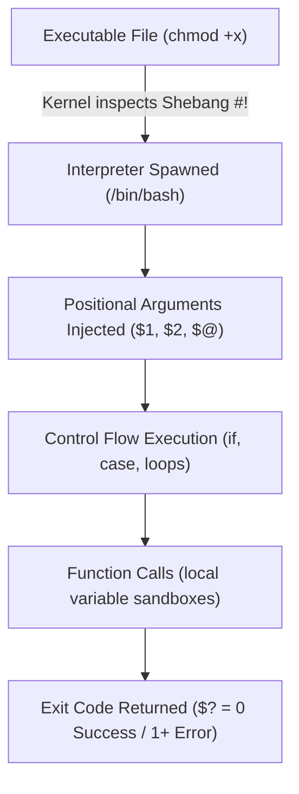

# Bash

Hub note for the Bash track. Each sub-note below matches one skill in [[Drills - Bash]], so drill misses have a home for their flashcards. The cards live in the sub-notes, not here.

## 🧠 The Core Concept

- **What is Bash Scripting?** Writing sequential shell commands and control structures into an executable text file to automate repetitive administration, deployment, and triage tasks.
- **The Shebang (`#!`):** The first two bytes of a script file (`0x23 0x21`). When the Linux kernel executes a file via `execve()`, it inspects the shebang to determine which binary interpreter to launch (e.g. `#!/usr/bin/env bash` or `#!/bin/sh`).
- **Execution Lifecycle & Permissions:**
  - `chmod u+x script.sh && ./script.sh`: Spawns a child shell process with the specified interpreter.
  - `source script.sh` (or `. script.sh`): Executes the script inside the **current** shell process, modifying current environment variables.



---

## 🗺️ The map (one note per drill skill)

| Drill skill | Note | What it covers |
| :--- | :--- | :--- |
| `args` | [[Bash Arguments and Usage]] | `$#`, `$0`, `"$@"`, usage line, exit non-zero |
| `exit-status` | [[Bash Exit Status and Strict Mode]] | `$?`, `&&`/`\|\|`, `set -euo pipefail`, `trap` |
| `conditionals` | [[Bash Conditionals]] | `if`/`elif` with `[[ ]]`, string vs integer tests, `case` |
| `loops` | [[Bash Loops]] | `for` over arrays, `while read -r`, the subshell trap |
| `functions` | [[Bash Functions]] | `local`, `return` vs `echo`, calling inside `if` |
| `plumbing` | [[Shell Plumbing]] | file descriptors, redirection order, pipes, here-docs, `sudo tee` |
| `text` | [[Text Processing Filters]] | `awk`, `sed`, `grep`, `cut`, `sort`, `uniq -c` |
| `services` | [[Service Checks in Bash]] | `pgrep`, `systemctl is-active`, restart and log |
| `files-logs` | [[Bash File Operations]] | file tests, safe read and atomic write, safe delete, locks, old files |

---

## 📚 Reference: variables, arrays, quoting

```bash
# 1. Variables (No spaces around "=")
app_env="production"
cluster_port=8080

# 2. Interactive Input
read -r -p "Enter cluster target: " target_name

# 3. Arrays (0-indexed list)
servers=("node-01" "node-02" "node-03")
echo "${servers[0]}"      # Prints first element: node-01
echo "${servers[@]}"      # Expands all elements
echo "${#servers[@]}"     # Array length: 3

# 4. Parameter Expansion (Case manipulation)
username="AdminUser"
echo "${username,}"       # First letter lowercase: adminUser
echo "${username,,}"      # All letters lowercase: adminuser
echo "${username^}"       # First letter uppercase: AdminUser
echo "${username^^}"      # All letters UPPERCASE: ADMINUSER

# 5. Defaults
file="${1:-/etc/hosts}"   # $1 if set and non-empty, else the default
```

- **Quoting & Expansions:**
  - `"$VAR"`: Expands the variable but preserves internal whitespace, preventing word splitting.
  - `'$VAR'`: Literal string (no variable expansion or wildcard evaluation).
  - `$(command)`: Command substitution. Preferred over legacy backticks (``` `command` ```) because it nests cleanly without messy backslash escaping.
- **Variable Scope (`export`):** Standard variables remain private to the current shell. The `export` keyword flags a variable for inclusion in the environment block passed down to child processes during `fork()` and `exec()`.

---

## 🔗 Connections (Mental Mapping)

- **Process Signals & Execution:** [[Process Control]]
- **Scheduled Automations:** [[Cron]]
- **System Supervision:** [[systemd]]
- **Practice:** [[Drills - Bash]], [[Drill Protocol]]
